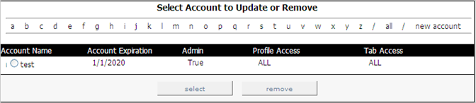

# Hinzufügen neuer Konten{#adding-new-accounts}

Schritte zum Hinzufügen neuer Konten.

1. Klicken Sie in [!DNL Report Portal] auf die Registerkarte **[!UICONTROL Admin]** . Die Seite [!DNL Admin] wird angezeigt.

   

1. Klicken Sie rechts auf der Seite auf **[!UICONTROL new account]**. Die Seite [!DNL Create New Account] wird angezeigt.

   

1. Füllen Sie alle Felder auf dieser Seite aus, wie in der folgenden Tabelle angegeben:

   | In diesem Feld . . . | Legen Sie . . . |
   |---|---|
   | Kontoname | Der Name des Kontos, das der Benutzer beim Anmelden bei [!DNL Report Portal] angeben muss. |
   | email | Die E-Mail-Adresse des Benutzers oder der Gruppe. |
   | password | Das Kennwort, das der Benutzer beim Anmelden bei [!DNL Report Portal] angeben muss. |
   | Passwort bestätigen | Das Kennwort, das der Benutzer beim Anmelden bei [!DNL Report Portal] angeben muss. |
   | Profilzugriff | Die Profile, auf die dieser Benutzer zugreifen darf (z. B. ProductSales). Um den Zugriff auf mehrere Profile zu ermöglichen, trennen Sie die Namen durch Kommas. Wenn der Benutzer auf alle Profile zugreifen darf, die mit [!DNL Report Portal] verknüpft sind, geben Sie &quot;ALL&quot;ein. |
   | Registerkartenzugriff | Die Registerkarten, auf die dieser Benutzer zugreifen darf (z. B. [!DNL Admin]). Um den Zugriff auf mehrere Registerkarten zu ermöglichen, trennen Sie die Namen durch Kommas. Wenn der Benutzer auf alle Registerkarten im [!DNL Report Portal] zugreifen darf, geben Sie &quot;ALL&quot;ein. Dieses Feld ist zusammen mit dem Feld &quot;Kontotyp&quot;sehr nützlich für die Definition von Gruppenzugriffsrechten. |
   | Kontotyp | Ob dieses Konto für eine Einzelperson oder eine Gruppe bestimmt ist. Einzelne Konten ermöglichen es Benutzern, ihre Kennwörter zurückzusetzen, Gruppen dagegen nicht. Ein Administrator ist die einzige Person, die das Kennwort für ein Gruppenkonto zurücksetzen kann. |
   | status | Ob dieses Konto aktiv oder inaktiv ist. Der Standardwert ist aktiv. Um ein Benutzerkonto zu deaktivieren, wählen Sie Inaktiv aus. |
   | admin | Gibt an, ob dieser Benutzer Benutzerkonten erstellen, aktualisieren und löschen sowie mit jedem Bericht verknüpfte Notizen bearbeiten kann. Die Standardeinstellung ist &quot;false&quot;. Um dies zu einem Administrator zu machen, wählen Sie &quot;true&quot;aus. |
   | Ablaufdatum | Das Datum im Format MM/TT/JJJJ, bis zu dem dieser Benutzer [!DNL Report Portal] verwenden darf. |

1. Klicken Sie auf **[!UICONTROL insert]**.
