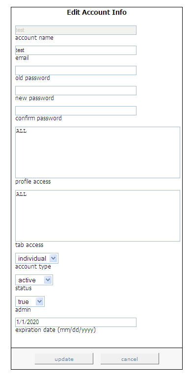

# Bearbeiten bestehender Benutzer{#editing-existing-users}

Schritte zum Bearbeiten vorhandener Benutzerkonten.

1. Klicken Sie in [!DNL Report Portal] auf die Registerkarte **[!UICONTROL Admin]**. Die Seite [!DNL Admin] wird angezeigt.

   

1. Klicken Sie auf den Brief, der den ersten Buchstaben des Kontonamens darstellt, den Sie bearbeiten möchten. Wenn Sie beispielsweise das Konto &quot;Marketing&quot;bearbeiten möchten, klicken Sie auf den Brief &quot;M&quot;.

   Eine Liste der Kontonamen, die mit diesem Brief beginnen, wird angezeigt.

1. Wählen Sie den Kontonamen aus, den Sie bearbeiten möchten, und klicken Sie dann auf die Schaltfläche **[!UICONTROL select]**. Die Seite [!DNL Edit Account Info] wird angezeigt.

   

1. Ändern Sie nur die zu aktualisierenden Felder auf dieser Seite. Die folgende Tabelle enthält Beschreibungen der einzelnen Felder:

   | In diesem Bereich. . . | Legen Sie . . . |
   |---|---|
   | email | Die E-Mail-Adresse des Benutzers. |
   | old password | Das aktuelle Kennwort, das zum Bearbeiten eines Admin-Kontos oder zum Zurücksetzen des Kennworts für ein Nicht-Admin-Konto benötigt wird. |
   | neues Kennwort | Das neue Kennwort, das der Benutzer bei der Anmeldung bei [!DNL Report Portal] angeben muss. |
   | Kennwort bestätigen | Das neue Kennwort, das der Benutzer bei der Anmeldung bei [!DNL Report Portal] angeben muss. |
   | Zugriff auf Profile | Die Profil, auf die dieser Benutzer zugreifen darf (z. B. ProductSales). Um den Zugriff auf mehrere Profil zu ermöglichen, trennen Sie die Namen durch Kommas. Wenn der Benutzer Zugriff auf alle mit [!DNL Report Portal] verknüpften Profil haben darf, geben Sie &quot;ALL&quot;ein. |
   | tab access | Die Registerkarten, auf die dieser Benutzer zugreifen darf (z. B. [!DNL Admin]). Um den Zugriff auf mehrere Registerkarten zu ermöglichen, trennen Sie die Namen durch Kommas. Wenn der Benutzer auf alle Registerkarten in [!DNL Report Portal] zugreifen darf, geben Sie &quot;ALL&quot;ein. Dieses Feld ist zusammen mit dem Feld für den Kontotyp sehr nützlich, um Gruppenzugriffsrechte zu definieren. |
   | Kontotyp | Ob dieses Konto für eine Einzelperson oder eine Gruppe gilt. Einzelne Konten ermöglichen es Benutzern, ihre Kennwörter zurückzusetzen, Gruppen dagegen nicht. Ein Administrator ist die einzige Person, die das Kennwort für ein Gruppenkonto zurücksetzen kann. |
   | status | Ob dieses Konto aktiv oder inaktiv ist. Der Standardwert ist aktiv. Um ein Benutzerkonto zu deaktivieren, wählen Sie **[!UICONTROL inactive]**. |
   | admin | Gibt an, ob dieser Benutzer Benutzerkonten erstellen, aktualisieren und löschen sowie mit jedem Bericht verknüpfte Anmerkungen bearbeiten darf. Die Standardeinstellung ist &quot;false&quot;. Um dies zu einem Administrator zu machen, wählen Sie &quot;true&quot;aus. |
   | Ablaufdatum | Das Datum im Format MM/TT/JJJJ, bis zu dem dieser Benutzer [!DNL Report Portal] verwenden darf. |

1. Klicken Sie auf **[!UICONTROL update]**.
