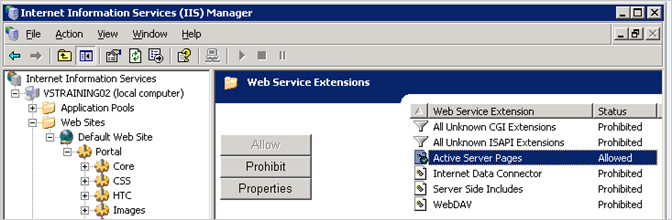

# Zuordnen von Report Portal zu einem virtuellen Verzeichnis (IIS 6.0 oder höher){#mapping-report-portal-to-a-virtual-directory-iis}

{{eol}}

Schritte zum Zuordnen des Report Portals zu einem virtuellen Verzeichnis (IIS 6.0).

Zuordnen der [!DNL Report Portal] in ein virtuelles Verzeichnis auf IIS 6.0 umfasst drei separate Aufgaben:

1. [Konfigurationsdatei bearbeiten](../../../../home/c-rpt-oview/c-install-rpt-port/c-virtual-dir/c-map-rpt-port-vdir-6.md#section-eaf1c58935074cfa840dac33e1286520)
1. [Importieren Sie die Konfigurationsdatei in IIS](../../../../home/c-rpt-oview/c-install-rpt-port/c-virtual-dir/c-map-rpt-port-vdir-6.md#section-9d61f6bfa93846dcb96973fec5573b19)
1. [Aktivieren aktiver Serverseiten (ASPs) in IIS](../../../../home/c-rpt-oview/c-install-rpt-port/c-virtual-dir/c-map-rpt-port-vdir-6.md#section-a7725ec2afc64ffc854c5bd8c5c31802)

Sie müssen alle drei Aufgaben erledigen.

## Bearbeiten der Konfigurationsdatei {#section-eaf1c58935074cfa840dac33e1286520}

1. Auf dem Computer, auf dem [!DNL Report Portal] installiert ist, öffnen Sie \*PortalName*\ReportPortalSetup.xml in einem Texteditor wie Notepad.

1. Verwenden Sie die Such- und Ersetzungsfunktion des Editors, um die Zeichenfolge &quot;VSVirtualPortalName&quot;global durch den Namen Ihres Portals zu ersetzen (Alle ersetzen). Wenn Sie beispielsweise &quot;VisualReportPortal&quot;als Namen für Ihre [!DNL Report Portal], würden Sie nach &quot;VSVirtualPortalName&quot;suchen und durch &quot;VisualReportPortal&quot;ersetzen.
1. Suchen Sie das folgende Element in dieser Datei:

   ```
   <IIsWebVirtualDir Location= "/LM/W3SVC/1/Root/PortalName/Output" AccessFlags="AccessRead | AccessScript” AppFriendlyName="Output" . . . >
   ```

1. Legen Sie die [!DNL Path] Attribut zum physischen Speicherort des Ordners, in dem sich [!DNL Report Server] speichert die Ausgabe für Ihre Berichtssätze.

   Der Ausgabeordner kann sich an einer beliebigen Stelle befinden, beliebig benannt werden und einen Unterordner für jeden Berichtssatz enthalten.

   >[!NOTE]
   >
   >Dieser Ordner muss mit dem Ordner übereinstimmen, den Sie im Parameter &quot;Output Root&quot;im [!DNL Report.cfg] -Datei für einen Berichtssatz. Weitere Informationen finden Sie unter [Konfigurieren von &quot;Report.cfg&quot;-Dateien](../../../../home/c-rpt-oview/c-admin-rpt/c-config-rpt-files.md#concept-cf4b95344fcb4c8c877db91e5f1d345d).

   Das folgende Codebeispiel zeigt, wie Sie die [!DNL Path] zuordnen, wenn Ihre Berichte in [!DNL E:\VSReport\ReportOutput]:

   ```
   < . . . 
   AppIsolated="2" 
       AppRoot="/LM/W3SVC/1/Root/PortalName/OutputFolder" 
       DirBrowseFlags="DirBrowseShowDate | DirBrowseShowTime |...  
       Path="E:\VSReport\ReportOutput"
   ```

   >[!NOTE]
   >
   >Es ist entscheidend, dass die [!DNL Path] -Attribut korrekt festgelegt ist.

1. Wenn Sie die Standardeinstellung [!DNL Path] des [!DNL Output] -Element, verschieben Sie die [!DNL profiles.xml] aus der *\PortalName*\PortalFiles\Output Ordner in den Ausgabeordner, den Sie in Schritt 4 angegeben haben. Im obigen Beispiel würden Sie [!DNL profiles.xml] nach [!DNL E:\VSReport\ReportOutput].

1. Stellen Sie sicher, dass [!DNL Path] -Attribute für alle anderen [!DNL IIsWebVirtualDir] -Elemente werden durch die Suche nach allen Instanzen von [!DNL C:\Inetpub\wwwroot] und ersetzen sie durch den richtigen Pfad.

1. Speichern Sie die Datei. Wenn Sie die Originaldatei beibehalten möchten, können Sie die Konfigurationsdatei unter einem neuen Namen speichern.

## Importieren der Konfigurationsdatei in IIS {#section-9d61f6bfa93846dcb96973fec5573b19}

1. Auf dem Computer, auf dem [!DNL Report Portal] installiert ist, starten Sie den IIS-Manager mit **[!UICONTROL Start]** > **[!UICONTROL Administrative Tools]** > **[!UICONTROL Internet Information Systems (IIS) Manager]**.

1. Auswählen **[!UICONTROL (local computer)]** > **[!UICONTROL Web Sites]** > **[!UICONTROL Default Web Site]**.

1. Rechtsklick **[!UICONTROL Default Web Site]** und wählen Sie **[!UICONTROL New]** > **[!UICONTROL Virtual Directory]** (aus Datei).

1. Wählen Sie die **[!UICONTROL ReportPortalSetup.xml]** Datei und klicken Sie auf **[!UICONTROL Read File]**.

1. Stellen Sie sicher, dass für Ihre [!DNL Report Portal] wie im folgenden Beispiel gezeigt.

   

   Wenn Sie nicht sechs virtuelle Verzeichnisse sehen oder eine Fehlermeldung erhalten, klicken Sie auf **[!UICONTROL Cancel]** und überprüfen Sie die Konfigurationsdatei auf Fehler.

1. Wählen Sie das erste virtuelle Verzeichnis in der Liste aus (das dem übergeordneten Verzeichnis der anderen fünf Ordner angehört) und klicken Sie auf **[!UICONTROL OK]**. IIS importiert die Zuordnungen und fügt die virtuellen Verzeichnisse zur Standardwebsite hinzu.

   Stellen Sie sicher, dass die resultierende Verzeichnisstruktur einen übergeordneten Ordner (mit demselben Namen wie Ihr Portal) und fünf Unterverzeichnisse hat, wie im folgenden Beispiel gezeigt.

   

1. Klicken Sie auf jedes virtuelle Verzeichnis, um sicherzustellen, dass IIS den physischen Ordner finden kann, den es darstellt. Wenn IIS einen Fehler anzeigt, klicken Sie mit der rechten Maustaste auf den Namen des virtuellen Ordners und überprüfen Sie, ob die [!DNL Local Path] -Feld auf das richtige physische Verzeichnis verweist.

## Aktivieren von aktiven Server-Seiten (ASPs) in IIS {#section-a7725ec2afc64ffc854c5bd8c5c31802}

Verwendung [!DNL Report Portal], müssen ASPs in IIS aktiviert sein. (Standardmäßig sind ASPs deaktiviert, wenn IIS 6.0 installiert ist.) Überprüfen Sie anhand des folgenden Verfahrens, ob ASPs in Ihrem IIS aktiviert sind.

1. Wählen Sie im Fenster IIS Manager die Option **[!UICONTROL (local computer)]** > **[!UICONTROL Web Service Extensions]**.
1. Stellen Sie sicher, dass [!DNL Active Server Pages] Erweiterung auf [!DNL Allowed].

   

1. Wenn ihr Status verboten ist, wählen Sie **[!UICONTROL Active Server Pages]** und klicken Sie auf **[!UICONTROL Allow]**.
1. Schließen Sie IIS Manager.
