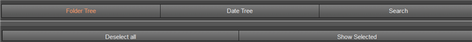

# Erweiterte Suche in Report Portal{#advanced-search-in-the-report-portal}

Das Report Portal bietet eine Suchfunktion, um Berichte auf der Grundlage einer Baumstruktur mit Ordnern, einer Baumstruktur mit Berichtsdaten und einer Ad-hoc-Suche zu suchen.

1. Klicken Sie im linken Bereich des Report Portals auf die Registerkarte **[!UICONTROL Search]**.

   

   Daraufhin wird eine neue Webseite mit der Ansicht **[!UICONTROL Search]** und der Option **[!UICONTROL Folder Tree]** geöffnet.

   

1. Wählen Sie aus den oben auf der Ansicht angezeigten Schaltflächen andere Optionen aus.

<table id="table_02610040A3284C07B62A6E70C0421573"> 
 <thead> 
  <tr> 
   <th colname="col1" class="entry"> Suchschaltfläche </th> 
   <th colname="col2" class="entry"> Beschreibung </th> 
  </tr> 
 </thead>
 <tbody> 
  <tr> 
   <td colname="col1"> 
Ordnerstruktur 
 </td> 
   <td colname="col2"> 
Wählen Sie Berichte basierend auf der benutzerdefinierten Hierarchie der Berichtsordner aus. Diese Ordner sind definiert und als <a href="../../home/c-rpt-oview/c-work-rpt-sets/c-work-rpt-sets.md#concept-a5f078668e1245e684cb2a778c8803d5"> Berichtssatz</a> organisiert. 
 </td> 
  </tr> 
  <tr> 
   <td colname="col1"> 
Datumsbaum 
 </td> 
   <td colname="col2"> 
Wählen Sie Ordner basierend auf einer vom Report Server definierten Datumshierarchie aus. Die Berichte basieren auf dem Datum (Jahr/Monat/Tag), an dem sie ausgeführt wurden. 
 </td> 
  </tr> 
  <tr> 
   <td colname="col1"> 
Durchsuchen 
 </td> 
   <td colname="col2"> 
Führen Sie Ad-hoc-Suchen in allen Ihren Berichten durch. Wenn Sie den vollständigen Namen des Berichts kennen, können Sie ihn direkt in das Suchfeld eingeben. 
 
Zusätzlich: 
 
    <ul id="ul_EAE30AAA865942078D0C6C0AE527C07C"> 
     <li id="li_F5213977442F4B89A62CA6BC315F95BE">Geben Sie eine &lt;space&gt;-Taste ein, um eine Dropdown-Liste der Anfangszeichen oder -namen für alle vorhandenen Berichte anzuzeigen. </li> 
     <li id="li_C28799438777471290B424CAFFCAF810">Geben Sie den Vornamen des Berichts ein und geben Sie eine &lt;Leertaste&gt;-Taste ein, um eine Dropdown-Liste anzuzeigen, mit der Sie den Namen für einen vorhandenen Bericht automatisch ausfüllen können. </li> 
    </ul> </td> 
  </tr> 
  <tr> 
   <td colname="col1"> 
Auswahl aufheben 
 </td> 
   <td colname="col2"> Klicken Sie auf , um alle ausgewählten Berichte zu löschen. </td> 
  </tr> 
  <tr> 
   <td colname="col1"> 
Ausgewählte anzeigen 
 </td> 
   <td colname="col2">Klicken Sie auf , um alle Berichte anzuzeigen, die in der Ordnerstruktur oder in den Ansichten der Datumsstruktur ausgewählt wurden. Das Report Portal wird in einem neuen Fenster geöffnet und zeigt jeden Bericht als PNG-Datei an. Wenn mehrere Berichte ausgewählt sind, kann jeder einzelne Bericht über eine Registerkarte oben auf der Seite ausgewählt werden. 
Klicken Sie auf dieser Seite auf die Schaltfläche  Drucken, um den ausgewählten Bericht zu drucken, oder klicken Sie auf  Herunterladen, um den Bericht lokal zu speichern. 
 </td> 
  </tr> 
 </tbody> 
</table>
