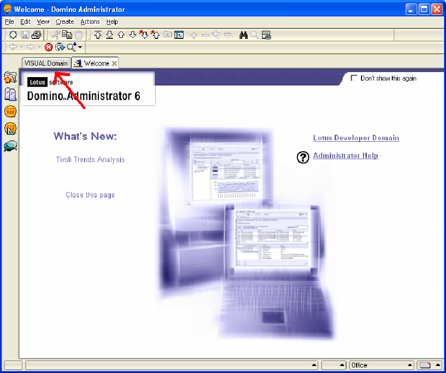
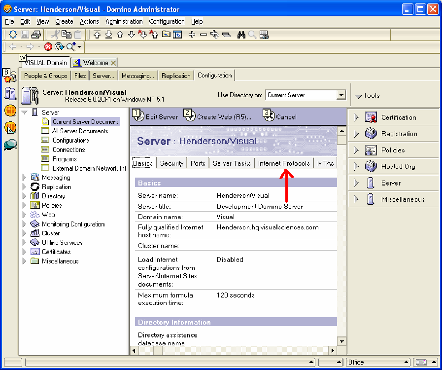

# Lotus Domino-Server unter Windows Server 2000 oder höher{#lotus-domino-server-on-windows-server-or-later}

{{eol}}

Anleitung zum Installieren und Konfigurieren von Sensor für Lotus Domino Server 6 für Windows 3.1 oder höher, das unter Microsoft Windows Server 2000 oder höher ausgeführt wird.

Die Programmdateien für Sensor werden in einer Installationsdatei zusammengefasst, die Sie von der Adobe-Download-Site erhalten. Wenn Sie noch nicht über die Installationsdatei für den Sensor für Ihren Webserver verfügen, laden Sie sie herunter (oder rufen Sie sie von Ihrem Kundenbetreuer ab), bevor Sie mit den folgenden Verfahren beginnen.

Um Sensor zu installieren und zu konfigurieren, müssen Sie die folgenden Schritte ausführen:

## Installieren der Programmdateien {#section-2f3e85083b4f4aa989a85997330e86ae}

1. Erstellen Sie auf Ihrem Lotus Domino-Computer einen Ordner, um die Programmdateien des Sensors zu installieren. Beachten Sie, dass sich Ihre Datenträgerwarteschlange auch in diesem Verzeichnis befindet. Stellen Sie daher sicher, dass das gewählte Gerät über ausreichend Speicherplatz verfügt, um eine Warteschlange mit der benötigten Größe zu speichern.

   ```
   C:\VisualSensor
   ```

1. Extrahieren Sie den Inhalt der Installationsdatei in das Verzeichnis Lotus Domino . Während dieses Schritts installiert Sensor die folgenden Dateien:

<table id="table_ABFF5F92271B4F3CB0AC68DAB6A5709F"> 
 <thead> 
  <tr> 
   <th colname="col1" class="entry"> Datei </th> 
   <th colname="col2" class="entry"> Beschreibung </th> 
  </tr> 
 </thead>
 <tbody> 
  <tr> 
   <td colname="col1"> EventMessages.dll </td> 
   <td colname="col2"> Ereignis-Viewer-Nachrichten </td> 
  </tr> 
  <tr> 
   <td colname="col1"> stchatlog.dll </td> 
   <td colname="col2"> Sammlermodul </td> 
  </tr> 
  <tr> 
   <td colname="col1"> <p>TestExperiment.xls </p> </td> 
   <td colname="col2"> <p>Eine Excel-Tabellenkalkulationsdatei, mit der Architekten ein gesteuertes Experiment konfigurieren können </p> <p>Sensor verwendet diese Datei nicht. </p> </td> 
  </tr> 
  <tr> 
   <td colname="col1"> trust_ca_cert.pem </td> 
   <td colname="col2"> Das Zertifikat, das zum Überprüfen des digitalen Zertifikats verwendet wird, das Insight Server während des Verbindungsprozesses präsentiert </td> 
  </tr> 
  <tr> 
   <td colname="col1"> TXLog.exe </td> 
   <td colname="col2"> Das Senderprogramm </td> 
  </tr> 
  <tr> 
   <td colname="col1"> <p>txlogd.conf </p> </td> 
   <td colname="col2"> Die Konfigurationsdatei für den Sensor </td> 
  </tr> 
 </tbody> 
</table>

>[!NOTE]
>
>Das Installationspaket enthält eine Tabellendatei mit dem Namen TestExperiment.xls. Diese Tabelle ist ein Tool, mit dem Architekten ein gesteuertes Experiment konfigurieren. Sensor selbst verwendet diese Datei nicht, daher ist es nicht notwendig, die Datei auf dem Computer zu installieren, auf dem Sensor ausgeführt wird (obwohl Sie dies tun können). Sie können die Datei stattdessen an einen Speicherort kopieren, an dem Ihre Architekten darauf zugreifen können, oder einfach die Datei aus dem Installationspaket extrahieren. Weitere Informationen zu kontrollierten Experimenten finden Sie im Leitfaden zu kontrollierten Experimenten mit Insight.

## Konfigurieren des Lotus Domino-Servers {#section-2e2f1875a5304cdfa2cbcd0680683cfd}

Schritte zum Konfigurieren des Lotus Domino-Servers.

1. Melden Sie sich beim Lotus Domino-Administrator an und klicken Sie auf **[!UICONTROL Domain]**.

   

1. Klicken Sie im Lotus Domino Administrator auf **[!UICONTROL Configuration]**.

   

1. Erweitern Sie den Knoten Server und klicken Sie auf **[!UICONTROL Current Server Document]**.

   

1. Klicken Sie auf **[!UICONTROL Current Server Document]** und dann auf **[!UICONTROL Internet Protocols]**.

   

1. Doppelklicken Sie auf der Registerkarte HTTP im Abschnitt DSAPI nach dem Wort [!DNL ndolextn].

   

1. Presse **[!UICONTROL Enter]** und geben Sie den Pfad zum [!DNL dominosensor.dll] -Datei.

   

1. Klicken Sie auf **[!UICONTROL Save & Close]**.

   

## Bearbeiten der Datei für die Sensor-Konfiguration {#section-de0eb4a646394b61abb6cd5a2b706de0}

Die Datei txlogd.conf enthält die Konfigurationsparameter für Sensor.

Sie müssen diese Datei bearbeiten, um unter anderem die Größe und den Speicherort der Warteschlangendatei der Festplatte, die Adresse des Insight-Servers und die ID anzugeben, die an die von diesem Sensor erzeugten Ereignisdaten angehängt werden.

Die Konfigurationsdatei enthält die erforderlichen Parameter und optionalen Parameter.

* **Erforderliche Parameter** sind Einstellungen, die Sie bei der Installation von Sensor angeben müssen. Ohne diese Einstellungen wird Sensor nicht erfolgreich ausgeführt.
* **Optionale Parameter** sind Einstellungen, die standardmäßig vordefinierte Werte enthalten (die Sie ändern können) oder optionale Funktionen aktivieren.

**Bearbeiten der Sensorkonfigurationsdatei**

* Öffnen Sie die `<Sensor directory>/txlogd.conf` in einem Texteditor speichern und die erforderlichen Parameter sowie die gewünschten optionalen Parameter festlegen.
* Speichern und schließen Sie die Datei.

## Starten Sie den Transmitter und erstellen Sie die Festplattenwarteschlange. {#section-55630de65f264274aefd771da2002852}

Nachdem Sie die Datei txlogd.conf konfiguriert haben, können Sie das Transmitter-Programm starten, sie als Windows-Dienst registrieren und die Disk-Warteschlange erstellen.

1. Wählen Sie im Startmenü unter Windows die Option **Zubehör** > **Eingabeaufforderung**.

1. Navigieren Sie im Eingabeaufforderungsfenster zum Ordner, in dem Sie Sensor installiert haben, und führen Sie den folgenden Befehl aus:

   ```
   txlog /regserver
   ```

   Dieser Befehl startet den Transmitter, erstellt die Festplattenwarteschlange und registriert Sensor als Windows-Dienst.

1. Um zu überprüfen, ob der Transmitter ordnungsgemäß ausgeführt wird, klicken Sie auf **Start > Systemsteuerung > Verwaltung > Dienste**.

   >[!NOTE]
   >
   >Diese Befehlssequenz variiert je nach verwendeter Windows-Version.

   1. Suchen Sie in der Dienstliste den Eintrag für Sensor und bestätigen Sie, dass sein Status Gestartet und sein Starttyp Automatisch lautet.
   1. Schließen Sie die Systemsteuerung &quot;Dienste&quot;.

1. Um zu überprüfen, ob Transmitter beim Start Fehler erhalten hat, klicken Sie auf Start > Systemsteuerung > Verwaltung > Ereignis-Viewer , um die Ereignisanzeige zu öffnen.

   >[!NOTE]
   >
   >Diese Befehlssequenz variiert je nach verwendeter Windows-Version.

   1. Wählen Sie im linken Bereich des Fensters Ereignis-Viewer das Protokoll Anwendungen aus.
   1. Suchen Sie im rechten Bereich nach Ereignissen mit &quot;Adobe&quot;in der Quellspalte.
   1. Doppelklicken Sie auf die Fehlermeldung &quot;Adobe&quot;, um das Fenster Ereigniseigenschaften anzuzeigen. In diesem Fenster erhalten Sie detaillierte Informationen zum Fehler.

1. Wenn Sie die Prüfung des Anwendungsprotokolls abgeschlossen haben, schließen Sie die Ereignisanzeige.
1. Stellen Sie sicher, dass der Transmitter die Festplattenwarteschlange ( [!DNL Diskq2000.log]) in dem Ordner, in dem Sie die Dateien des Sensor-Programms installiert haben, und dass es sich um die in der Datei [!DNL QueueSize] -Parameter in der [!DNL txlogd.conf] -Datei.

   Wenn die Warteschlange nicht korrekt erstellt wurde:

   1. Überprüfen Sie die Datei txtlogd.conf und überprüfen Sie, ob der Parameter QueueSize richtig eingestellt ist.
   1. Vergewissern Sie sich, dass auf dem Gerät, auf dem Sie Sensor installiert haben, ausreichend Speicherplatz für eine Datei zur Verfügung steht, die der im Parameter QueueSize angegebenen Größe entspricht.
   1. Beenden Sie den Transmitter über das Bedienfeld Dienste in Windows.
   1. Löschen Sie die Warteschlangendatei.
   1. Registrieren Sie Sensor als Windows-Dienst erneut: Wählen Sie unter Windows im Menü Start die Option Zubehör > Eingabeaufforderung aus. Navigieren Sie im Eingabeaufforderungsfenster zum Ordner, in dem Sie Sensor installiert haben, und führen Sie den folgenden Befehl aus:

      ```
      txlog /regserver
      ```

      Der Transmitter ist für eine kontinuierliche Ausführung ausgelegt. Wenn Sie den Computer neu starten, wird der Transmitter automatisch neu gestartet. Wenn Sie den Transmitter manuell starten und anhalten müssen, können Sie dies über die Systemsteuerung Dienste in Windows tun.
