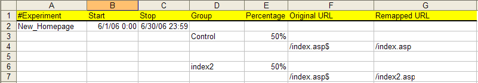

# Konfigurieren und Implementieren des Experiments{#configuring-and-deploying-the-experiment}

Nachdem Sie Ihre Zielsetzung, Hypothese und Experimentdetails sowie Ihren Testinhalt definiert haben, müssen Sie Sensor für die Bereitstellung des kontrollierten Experiments konfigurieren.

## Konfigurieren der Experimentkonfigurationsdatei {#section-037fe7dea9c94aee9cdc354dafdb7c03}

Um das Experiment zu konfigurieren, müssen Sie die von Adobe bereitgestellte Tabelle zur Experimentkonfiguration (mit dem Namen [!DNL TestExperiment.xls] Standard). Diese Datei konfiguriert [!DNL Sensor] , um das Experiment durchzuführen, und ist die Excel-Version der Textdatei, die Sie in [Bearbeiten des ExpFile-Parameters](../../../home/c-undst-ctrld-exp/t-en-ctrld-exp/c-mod-expfile-prm.md#concept-25232b386a654870becc789d4f1fcc28).

Diese Datei kann Informationen über mehrere Experimente enthalten, die gleichzeitig oder zu unterschiedlichen Zeitpunkten ausgeführt werden können und unterschiedliche Gruppen und Prozentsätze verwenden. Diese Experimente werden jedoch in keiner Weise korreliert.

Benutzer werden für jedes Experiment in einer Gruppe platziert, die in der Datei aufgeführt ist, die für die aktuelle Ausführung konfiguriert ist.

>[!NOTE]
>
>Jedes Experiment ist unabhängig von allen anderen Experimenten. Änderungen, die Sie an einem Experiment vornehmen, wirken sich nicht auf andere Experimente aus. Auch wenn sich Besucher in mehreren Experimenten befinden, beziehen sich die Ergebnisse nicht gegenseitig. Wenn Sie glauben, dass eine Korrelation zwischen den Änderungen in mehreren Experimenten besteht, müssen Sie ein neues Experiment erstellen, das diese Änderungen gemeinsam testet.

**So konfigurieren Sie Ihr Experiment**

Sie sollten diese Datei vor Beginn des Experiments abschließen und die Informationen nicht ändern, während das Experiment ausgeführt wird.

>[!NOTE]
>
>Ein Experiment ist sofort ungültig, wenn sich die Definition des Experiments nach Beginn des Experiments ändert.

1. Wenn Sie über Administratorzugriff auf Ihre Web- oder Anwendungsserver verfügen, navigieren Sie zum [!DNL Sensor] Installationsordner auf einem beliebigen [!DNL Sensor] Computer in Ihrem Webcluster für den Zugriff auf [!DNL TestExperiment.xls] -Datei. Wenn Sie keinen Administratorzugriff haben, wenden Sie sich an Ihren Kundenbetreuer von Adobe, um die [!DNL TestExperiment.xls] -Datei.

1. Öffnen Sie die [!DNL TestExperiment.xls] Datei (Sie können diese Datei bei Bedarf umbenennen) und die folgenden Felder ausfüllen:

<table id="table_FDD6AE631C614F97AD7AE8829E53CCAC"> 
 <thead> 
  <tr> 
   <th colname="col1" class="entry"> Feld </th> 
   <th colname="col2" class="entry"> Beschreibung </th> 
  </tr> 
 </thead>
 <tbody> 
  <tr> 
   <td colname="col1"> Experiment </td> 
   <td colname="col2"> 
Ein beschreibender Name für das Experiment. Jeder Experimentname muss eindeutig sein und darf keine Leerzeichen enthalten. 
 
Experimentnamen werden verwendet, wenn die Ergebnisse von Experimenten in  Insight . Die Namen werden als erste Hälfte der Elementnamen in der Dimension "gesteuertes Experiment"angezeigt. Die zweite Hälfte des Elementnamens ist der Gruppenname aus dem Feld Gruppe in dieser Datei. Jede Gruppe wird im folgenden Format mit dem Experimentnamen gefolgt vom Gruppennamen benannt: 
 
<i>ExperimentName.Group Name</i> 
 
Beispiel:  new_homepage.control  
 </td> 
  </tr> 
  <tr> 
   <td colname="col1"> Start </td> 
   <td colname="col2"> 
Datum und Uhrzeit des Beginns des Experiments. Wenn Sie keine Werte eingeben, beginnt das Experiment unmittelbar nach der Bereitstellung der Datei. 
 
Format: MM/TT/JJJJ H:MM 
 
    <ul id="ul_FB8B50C688584683AC2226FCBED40AF9"> 
     <li id="li_223EF962CFC64454965444E66284F670">Wenn Sie die Start- und Stoppzeiten leer lassen, läuft das Experiment unbegrenzt. </li> 
     <li id="li_0544C9A98635418CAECD85B67F345772">Sie können die Start- und Stoppzeiten lange im Voraus festlegen. Daher können Sie alle Ihre Experimente für das nächste Jahr auf einmal konfigurieren, falls gewünscht. </li> 
     <li id="li_BDFBB74B1D134E57B37DC5C3457AA1A9">Start- und Stopp-Zeiten basieren auf der Systemzeit des Webservers. Wenn sich diese Uhr aus irgendeinem Grund ändert, kann Ihr Experiment unerwartet starten oder anhalten. </li> 
     <li id="li_3295FE5B2AC64B6CA90CC7F31B808EB9">Wenn Sie ein Experiment als Konfigurationsdateieintrag hinzufügen möchten, das Experiment aber nicht in naher Zukunft ausführen möchten, können Sie die Experimentinformationen mit dem Nummernzeichen "#"auskommentieren oder frühere Start- und Stoppzeiten definieren. </li> 
    </ul> </td> 
  </tr> 
  <tr> 
   <td colname="col1"> Stop </td> 
   <td colname="col2"> 
Datum und Uhrzeit des Endes des Experiments. Wenn das Enddatum und die Endzeit eintreten,  Sensor  beendet den Versand der als Testgruppe identifizierten Cookie-Werte an die Test-URIs und sendet alle Cookies an die Kontrollgruppen-URIs. 
 
Format: MM/TT/JJJJ H:MM 
 
Siehe die Hinweise für die  Starten  -Feld. 
 </td> 
  </tr> 
  <tr> 
   <td colname="col1"> Gruppe </td> 
   <td colname="col2"> 
Ein beschreibender Name für jede Besuchergruppe im Experiment. Gruppennamen dürfen keine Leerzeichen enthalten. 
 
Gruppennamen werden verwendet, wenn die Ergebnisse von Experimenten in  Insight . Weitere Informationen finden Sie in der Beschreibung des Experimentfelds. 
 
Eine Kontrollgruppe kann implizit oder explizit definiert werden, basierend auf dem im Feld Prozentsatz angegebenen Wert. 
 
 
Hinweis: Um die Anzahl der Besucher zu erreichen, die im festgelegten Zeitraum für die statistische Gültigkeit des Experiments erforderlich sind, müssen Sie möglicherweise das Konfidenzniveau senken oder den Zeitraum erhöhen. Wenn Ihr Zeitraum z. B. fünf Tage beträgt, Ihr Konfidenzniveau 98 % beträgt und Ihre Besucheranzahl die für diesen Zeitraum erwartete Anzahl überschreitet, müssen Sie entweder den Zeitraum erhöhen oder das Konfidenzniveau senken, bis die erwartete Anzahl der Besucher die für ein statistisch gültiges Experiment erforderliche Anzahl überschreitet. 
 
 </td> 
  </tr> 
  <tr> 
   <td colname="col1"> Prozentsatz </td> 
   <td colname="col2"> 
Der Prozentsatz der Website-Besucher, die in jede definierte Gruppe einbezogen werden sollen. Diese Werte können entweder als Prozentwerte oder als Dezimalwerte ausgedrückt werden. Darüber hinaus müssen beide Werte größer oder kleiner als 1 sein. 
 
Beispiel: 
 
33,3 % und 66,7 % 
 
.99 und .01 
 
Wenn die Summe für alle Gruppen kleiner als 100 ist, wird der nicht definierte Überschuss standardmäßig auf eine Kontrollgruppe festgelegt. 
 </td> 
  </tr> 
  <tr> 
   <td colname="col1"> Ursprüngliche URL </td> 
   <td colname="col2"> 
Der URI des zu entfernenden Inhalts, gefolgt von $. Bei diesem Wert wird zwischen Groß- und Kleinschreibung unterschieden. 
 
Format: index.asp$ 
 
Original-URIs können mit einem Dollarzeichen ($) am Ende des URI angegeben werden, um anzugeben, dass eine exakte Übereinstimmung mit dem Dateinamen erforderlich ist. Beispielsweise der Ausdruck  /product/product_view.asp$  entspricht nur der exakten Seite, während  /product  stimmt mit allen Seiten im  /product  und verwendet werden können, um diese gesamte Unterstruktur zu regenerieren. Ursprüngliche URL-Einträge, die das Zeichen $ am Ende des Dateinamens nicht angeben, werden vom Experiment ignoriert, es sei denn, der Parameter ExpPartialMatch wurde auf "on"gesetzt. Weitere Informationen zu diesem Parameter finden Sie unter <a href="../../../home/c-undst-ctrld-exp/t-en-ctrld-exp/c-mod-expplmth-prm.md#concept-9c817c4c49b74287b0f70d6a1a37655e"> Bearbeiten des ExpPartialMatch-Parameters (optional) </a>. 
 
Die Funktion für kontrollierte Experimente ignoriert alle Abfragezeichenfolgen, die an den URI-Stamm angehängt sind. Beispielsweise wird die Seite 
 
  /product/product_view.asp?productid=53982  ist kein gültiger URI, aber die Seite  /product/product_view.asp  ist ein gültiger URI. 
 </td> 
  </tr> 
  <tr> 
   <td colname="col1"> Remote URL </td> 
   <td colname="col2"> 
Der URI des alternativen Inhalts. 
 
Format: index2.asp 
 
Weitere Informationen finden Sie in den Hinweisen zum Feld Ursprüngliche URL . 
 </td> 
  </tr> 
 </tbody> 
</table>

Im Folgenden finden Sie ein Beispiel für einen abgeschlossenen [!DNL TextExperiment.xls] Tabelle:

>[!NOTE]
>
>Ändern Sie nicht die Spaltenpositionen im Arbeitsblatt.

Dieses Beispiel weist darauf hin, dass das Experiment &quot;New_Homepage&quot;am 1. Juni 2006 beginnt, am 30. Juni 2006 endet und eine Kontrollgruppe mit 50 % der Besucher sowie eine Testgruppe mit 50 % der Besucher enthält, die unterschiedliche Inhalte für eine URI sehen.

>[!NOTE]
>
>Obwohl in der obigen Beispieldatei eine explizite Kontrollgruppe definiert ist, ist es nicht erforderlich, eine Kontrollgruppe explizit zu definieren - das Experiment erstellt automatisch die Kontrollgruppe. Wenn die Summe der Prozentsätze für alle Gruppen in einem Experiment weniger als 100 % beträgt, wird Benutzern, die nicht in eine der expliziten Gruppen fallen, eine implizite Kontrollgruppe zugewiesen.

1. Um Kommentare einzufügen, die zusätzliche Informationen zu bestimmten Experimenten liefern, beginnen Sie die Zelle mit einem Nummernzeichen (#) und folgen Sie Ihren Kommentaren. Kommentare können an einer beliebigen Stelle in die Datei eingefügt werden.
1. Nachdem Sie die Variablen im Tabelle mit der Experimentkonfiguration abgeschlossen haben, speichern Sie die Änderungen und speichern Sie die Datei im tabulatorgetrennten Textformat ( [!DNL *.txt]) unter Verwendung des Namens, den Sie im Parameter ExpFile im [!DNL Sensor] Konfigurationsdatei. Siehe [Bearbeiten des ExpFile-Parameters](../../../home/c-undst-ctrld-exp/t-en-ctrld-exp/c-mod-expfile-prm.md#concept-25232b386a654870becc789d4f1fcc28).

   Im Folgenden finden Sie ein Beispiel für eine Textdatei für eine Experimentkonfiguration:

   

   >[!NOTE]
   >
   >Bearbeiten Sie aufgrund der in dieser Datei erforderlichen Registerkarten nicht die Textdatei für die Experimentkonfiguration manuell. Wenn Sie Änderungen an der Datei vornehmen müssen, nehmen Sie die Änderungen in der Excel-Datei für die Experimentkonfiguration vor und speichern Sie die Datei erneut als tabulatorgetrennte Textdatei.

Wenn Sie die Start- und Stoppzeiten definiert haben, besteht kein Grund, ein Experiment jemals aus der Konfigurationsdatei für Experimente zu löschen. Alle Experimente in der Experimentkonfigurationsdatei aufgelistet zu halten, ist eigentlich eine gute Möglichkeit, einen Datensatz darüber zu speichern, wie Sie jedes Ihrer Experimente definiert haben.

## Bereitstellen der Konfigurationsdatei und Testen des Inhalts {#section-34ff29649f584b93bc6129b75084b37c}

Sie müssen die Experiment-Konfigurationsdatei auf jedem Computer in Ihrem Webcluster bereitstellen, auf dem ein [!DNL Sensor] und die im Experiment beteiligten Seiten bedienen. Hierzu können Sie entweder ein manuelles Verfahren oder Ihr vorhandenes Content-Management-System verwenden.

**So stellen Sie Testinhalte bereit**

* Auf allen Anwendungen oder Webservern, auf denen eine [!DNL Sensor] Wenn Sie Seiten bereitstellen, die am Experiment beteiligt sind, verwenden Sie Ihren vorhandenen Veröffentlichungsprozess, um den Testinhalt an der entsprechenden Stelle bereitzustellen.

   Wenn Sie beispielsweise die Testgruppenseite veröffentlichen möchten [!DNL index2.asp] zum Testordner für Ihre Website ( [!DNL mysite.com]), veröffentlichen Sie die Datei in [!DNL www.mysite.com/test].

   >[!NOTE]
   >
   >Verknüpfen Sie keine Ihrer Testdateien direkt von einer Seite auf Ihrer Website aus. Dadurch werden Ihre Testergebnisse und Indexwerte ungültig.

**Bereitstellen des Experiments**

* Auf allen Anwendungen oder Webservern, auf denen eine [!DNL Sensor] die Seiten bereitstellt, die am Experiment beteiligt sind, platzieren Sie die Textdatei für die Experimentkonfiguration in dem Verzeichnis, das Sie im Parameter ExpFile im [!DNL Sensor] Konfigurationsdatei. Siehe [Bearbeiten des ExpFile-Parameters](../../../home/c-undst-ctrld-exp/t-en-ctrld-exp/c-mod-expfile-prm.md#concept-25232b386a654870becc789d4f1fcc28).

[!DNL Sensor] wählt nach dem Zufallsprinzip Website-Besucher für jede Gruppe basierend auf den Prozentsätzen aus, die Sie in der Datei definiert haben, und stellt ihnen den Test- oder Kontrollgruppeninhalt entsprechend bereit.
