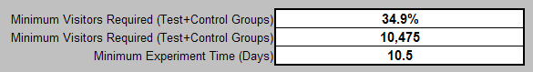

# Tabelle &quot;Experimententwurf&quot;{#experiment-design-spreadsheet}

Diese Datei funktioniert nicht nur als Arbeitsblatt, sondern auch als Aufzeichnung Ihrer Experimententscheidungen.

Wenn Sie Hilfe beim Entwerfen Ihres Experiments benötigen, können Sie die von Adobe bereitgestellte Tabelle zum Testentwurf verwenden (standardmäßig &quot;VS Controlled Experiment Design.xls&quot;genannt).

Die Tabelle zum Testentwurf kann nur dann nützliche statistische Schlussfolgerungen liefern, wenn die betreffende Metrik als Prozentsatz der Besucher definiert wird, die bestimmte Kriterien erfüllen. Das heißt, es ist nur nützlich, wenn eine besucherbasierte Metrikhypothese getestet wird.

**So entwerfen Sie Ihr Experiment mit der Experimententwurfdatei**

1. Wenn Sie über Administratorzugriff auf Ihre Web- oder Anwendungsserver verfügen, navigieren Sie zum [!DNL Sensor] Installationsordner auf einem beliebigen [!DNL Sensor] Computer im Webcluster. Wenn Sie keinen Administratorzugriff haben, wenden Sie sich an Ihren Adobe-Kundenbetreuer, um die Datei anzufordern.
1. Öffnen Sie die Datei &quot;VS Controlled Experiment Design.xls&quot;. (Sie können diese Datei bei Bedarf umbenennen.)

   Die Tabelle auf der folgenden Seite ist ein Beispiel dafür, wie Sie die Tabelle bei der Vorbereitung zum Testen der in diesem Handbuch verwendeten Beispielhypothese abschließen würden.

   

   

   

1. Geben Sie Text oder Werte für alle blauen Felder in dieser Datei ein, die in der folgenden Tabelle beschrieben werden. Die berechneten Felder werden in der zweiten Tabelle definiert.

<table id="table_C343F7A4BF3D4E0E9A5E9739EC7C2E10"> 
 <thead> 
  <tr> 
   <th colname="col1" class="entry"> In diesem Bereich... </th> 
   <th colname="col2" class="entry"> Legen Sie </th> 
  </tr> 
 </thead>
 <tbody> 
  <tr> 
   <td colname="col1"> Experimenttitel </td> 
   <td colname="col2"> Ein beschreibender Name für Ihr Experiment. </td> 
  </tr> 
  <tr> 
   <td colname="col1"> Experimentbeschreibung </td> 
   <td colname="col2"> Eine Textbeschreibung des Experiments. </td> 
  </tr> 
  <tr> 
   <td colname="col1"> Zu untersuchende Metrik </td> 
   <td colname="col2"> 
Der Name der Metrik, auf der das Experiment basiert. 
 
Beispiel: Besucherumrechnung 
 </td> 
  </tr> 
  <tr> 
   <td colname="col1"> Metrikdefinition </td> 
   <td colname="col2"> 
Die Definition der Metrik, auf der das Experiment basiert. 
 
Format: Besucher[X]/Besucher 
 
Beispiel:  Visitors[URI='conversionpage.asp']/Visitors
 </td> 
  </tr> 
  <tr> 
   <td colname="col1"> Vorgesehene Startzeit </td> 
   <td colname="col2"> Datum und Uhrzeit des Experiments. </td> 
  </tr> 
  <tr> 
   <td colname="col1"> Vorgesehene Endzeit </td> 
   <td colname="col2"> Datum und Uhrzeit des Endes des Experiments. </td> 
  </tr> 
  <tr> 
   <td colname="col1"> Gültige Auswahl </td> 
   <td colname="col2"> (Optional) Der Dimensionsname und der Elementsatz bzw. der Bereich, mit dem Sie den Datensatz weiter segmentieren möchten. </td> 
  </tr> 
  <tr> 
   <td colname="col1"> Experiment-URIs </td> 
   <td colname="col2"> Die an Ihrer Hypothese beteiligten URIs. Sie definieren die aktuellen URIs für die Kontrollgruppe und die alternativen URIs, die Sie für die Testgruppe/n erstellt haben oder erstellen werden. </td> 
  </tr> 
  <tr> 
   <td colname="col1"> Erwartete Metriken für Anwendungsauswahl </td> 
   <td colname="col2"> Überschrift für die Metrikwerte, die Sie für Ihre Website erwarten. </td> 
  </tr> 
  <tr> 
   <td colname="col1"> Durchschnittliche Besucher pro Tag </td> 
   <td colname="col2"> Die durchschnittliche Anzahl der Besucher Ihrer Website pro Tag. </td> 
  </tr> 
  <tr> 
   <td colname="col1"> Besucherumrechnung </td> 
   <td colname="col2"> Die durchschnittliche Besucherkonversionsrate für Ihre Website. </td> 
  </tr> 
  <tr> 
   <td colname="col1"> Experiment ermittelt, ob der Metrikname für die Testgruppen ... </td> 
   <td colname="col2"> Überschrift zum Vergleich der Metrikwerte. </td> 
  </tr> 
  <tr> 
   <td colname="col1"> Größer als der Wert für die Kontrollgruppe? </td> 
   <td colname="col2"> Setzen Sie dieses Feld auf "True", wenn Sie feststellen möchten, dass die Metrik der Testgruppe während des Experiments erhöht wurde. Setzen Sie dieses Feld auf "False", um die Anzahl der Besucher zu verringern, die zum Zeichnen von Schlussfolgerungen benötigt werden. Adobe empfiehlt, dass Sie True festlegen. </td> 
  </tr> 
  <tr> 
   <td colname="col1"> Kleiner als der Wert für die Kontrollgruppe? </td> 
   <td colname="col2"> Setzen Sie dieses Feld auf True, wenn Sie feststellen möchten, dass die Metrik der Testgruppe während des Experiments verringert wurde. Adobe empfiehlt, dass Sie True festlegen. </td> 
  </tr> 
  <tr> 
   <td colname="col1"> Mindestens um (Erkennungsstufe) </td> 
   <td colname="col2"> Der Prozentsatz, um den die Metrik für die Testgruppe höher oder niedriger als der für die Kontrollgruppe sein soll. </td> 
  </tr> 
  <tr> 
   <td colname="col1"> mit einem Vertrauensniveau von mindestens </td> 
   <td colname="col2"> Das gewünschte Konfidenzniveau für die Testgruppenwerte. Das Vertrauensniveau bestimmt die Anzahl der Falsch-Positiv-Werte, um die Wahrscheinlichkeit zu messen, dass die angegebene Erwartung wahr ist. </td> 
  </tr> 
  <tr> 
   <td colname="col1"> und ein Leistungsniveau von </td> 
   <td colname="col2"> Der gewünschte Leistungsgrad für die Testgruppenwerte. Der Leistungsgrad bestimmt die Anzahl der Falsch-Negative. </td> 
  </tr> 
  <tr> 
   <td colname="col1"> % der Besucher </td> 
   <td colname="col2"> Überschrift für den Prozentsatz der Besucherwerte. </td> 
  </tr> 
  <tr> 
   <td colname="col1"> Testgruppe </td> 
   <td colname="col2"> Prozentsatz der Besucher, die Sie in die Testgruppe aufnehmen möchten. Sie können mit dieser Zahl abspielen, bis der Wert im Feld "Summe"(normalerweise 100 %) im Abschnitt "Besucher"dem Wert im Feld "Erforderliche Mindestbesucher (Test- und Kontrollgruppen)"entspricht oder diesen Wert überschreitet. Beide Werte werden in der folgenden Tabelle beschrieben. </td> 
  </tr> 
  <tr> 
   <td colname="col1"> Kontrollgruppe </td> 
   <td colname="col2"> Prozentsatz der Besucher, die Sie in die Kontrollgruppe aufnehmen möchten. </td> 
  </tr> 
  <tr> 
   <td colname="col1"> Andere Design-Hinweise </td> 
   <td colname="col2"> Alle Notizen, die Sie zur späteren Verwendung speichern möchten. </td> 
  </tr> 
 </tbody> 
</table>

Die übrigen Felder werden auf der Grundlage der eingegebenen Werte berechnet und in der folgenden Tabelle beschrieben.

| Feld | Beschreibung |
|---|---|
| Erwartete Metriken für Anwendungsauswahl | Überschrift für die Metrikwerte, die Sie für Ihre Website erwarten. |
| Erwartete Besucher pro Zeitraum | Dieses Feld wird normalerweise automatisch anhand der Tabelle berechnet. Es wird davon ausgegangen, dass die Website an den meisten Tagen viel mehr neue Besucher erhält als zurückkehrende Besucher. Ist dies nicht der Fall, sollte die Berechnung dieser Zelle mit der tatsächlichen Anzahl der während des Experiments erwarteten Besucher überschrieben werden. |
| Berechnete Z-Bewertung für Fehler Typ I | Der Z-Wert für ein falsch positives Ergebnis. Dies ist eine statistische Zwischenberechnung. |
| Berechnete Z-Bewertung für Fehler Typ II | Der Z-Wert für ein falsches negatives Ergebnis. Dies ist eine statistische Zwischenberechnung. |
| Erforderliche Mindestbesucher (Test+Kontrollgruppen) | Mindestanzahl der Besucher, die im Experiment benötigt werden, um Ihr angegebenes Konfidenzniveau, Leistungsniveau und z-Wert zu erreichen, ausgedrückt als Prozentsatz des Werts im Feld Erwartete Besucher pro Zeitraum. |
| Erforderliche Mindestbesucher (Test+Kontrollgruppen) | Mindestanzahl der Besucher, die im Experiment benötigt werden, um Ihr angegebenes Konfidenzniveau, Leistungsniveau und z-Wert zu erreichen. Dieser Wert muss kleiner oder gleich dem Wert im Feld &quot;Summe&quot;(normalerweise 100 %) im Abschnitt &quot;Besucher&quot;sein. |
| Mindestversuchszeit (Tage) | Mindestanzahl von Tagen, die Sie zum Ausführen des Experiments benötigen, um das angegebene Konfidenzniveau, den Leistungsgrad und den Z-Wert zu erreichen. Diese berechnete Zahl unterliegt denselben Problemen wie im Feld Erwartete Besucher pro Zeitraum beschrieben. Bei einer Website mit vielen wiederkehrenden Besuchern ist das Feld &quot;Mindestversuchszeit (Tage)&quot;die erwartete Anzahl von Tagen, die benötigt wird, um eine Anzahl individueller Besucher anzuzeigen, die dem Wert im Feld &quot;Erforderliche Mindestbesucher&quot;entspricht. |
| Besucher | Überschrift für die Besucherwerte. |
| Testgruppe | Anzahl der in der Testgruppe benötigten Besucher. |
| Kontrollgruppe | Anzahl der in der Kontrollgruppe benötigten Besucher. |
| Gesamt (in der Regel 100%) | Gesamtzahl der für das Experiment benötigten Besucher. Dieser Wert muss gleich oder größer als der Wert im Feld &quot;Erforderliche Mindestbesucher (Test+Kontrollgruppen)&quot;sein. |
| Genauigkeit der Testgruppe (auf Target-Konfidenzebene) | Prozentsatz, der angibt, dass eine Chance besteht, die dem angegebenen Konfidenzniveau entspricht, dass der für die Testgruppe berechnete gemessene Wert der Metrik innerhalb dieses Prozentsatzes vom tatsächlichen Wert liegt. |
| Genauigkeit der Kontrollgruppe (auf der Ebene der Zielsicherheit) | Prozentsatz, der angibt, dass eine Chance besteht, die dem angegebenen Konfidenzniveau entspricht, dass der für die Kontrollgruppe berechnete gemessene Wert der Metrik in diesem Prozentsatz ihres tatsächlichen Wertes liegt. |
| Z-Ergebnis (bei Zielgenauigkeit) | Anzahl der Standardabweichungen, bei denen ein bestimmter Wert vom Prüfmittelwert abweicht. |
| Tatsächliche Konfidenzstufe (im Zielintervall) | Das für den Versuch erzielte Vertrauensniveau. Das Konfidenzniveau misst die Wahrscheinlichkeit, dass die angegebene Erwartung wahr ist. |
| Tatsächliches Intervall (auf der Ebene der Zielsicherheit) | Das für den Versuch erreichte Konfidenzintervall, das einen geschätzten Wertebereich bereitstellt, der wahrscheinlich einen unbekannten Populationsparameter enthält. Dieser Bereich wird aus einem bestimmten Satz von Musterdaten berechnet. |

Sie müssen sich den Wert im Feld Erforderliche Mindestbesucher (Test+Kontrollgruppen) ansehen. . .

und mit dem Wert im Feld &quot;Gesamt&quot;in der [!DNL Visitors] Spalte vergleichen.

Damit Ihr Experiment statistisch gültig ist, muss der Wert im Feld &quot;Summe&quot;(normalerweise 100 %) gleich oder größer als der Wert im Feld &quot;Erforderliche Mindestbesucher&quot;(Test+Kontrollgruppen) sein.

Angesichts der bereitgestellten Eingaben zeigt das Beispielarbeitsblatt, dass 10.475 Besucher an diesem Experiment teilnehmen müssen, um die eingegebene Konfidenzrate von 95 % zu erreichen (was die empfohlene Mindestsicherheit für ein kontrolliertes Experiment ist, obwohl Sie diese Zahl erhöhen können). Das derzeit entworfene Experiment umfasst 30.000 Besucher, was deutlich über der Mindestanzahl der erforderlichen Besucher liegt.

Wenn Sie die Anzahl der Tage beibehalten, können Sie das Konfidenzniveau erhöhen, solange die Gesamtanzahl der Besucher die erforderliche Mindestanzahl erreicht oder überschreitet.

1. Speichern Sie die Datei für Ihre Datensätze und konfigurieren Sie dann mithilfe der Informationen aus der Datei das Experiment mithilfe der Tabelle für die Experimentkonfiguration. Weitere Informationen zu dieser Tabelle finden Sie unter [Konfigurieren und Bereitstellen des Experiments](../../home/c-undst-ctrld-exp/t-crt-ctrld-exp/c-cnfg-dply-exp.md#concept-50f1de0242904698937bb72b3ea1b429).
