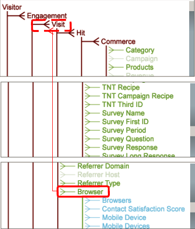

# Tabellenstrukturen für Schema-Design{#schema-design-countable-structures}

Erläuterung von Countables in DataWorkbench (DWB) zum Entwerfen und Implementieren des Schemas.

## Grundlagen zur Zählung in Data Workbench {#section-6e6b8d1c17634d669e62c91a80a0bc62}

Auf der höchsten Ebene befinden sich zählbare Dimensionen. Zählbare Dimensionen dienen zwei Hauptfunktionen. Zunächst sind es Dimensionen, deren Elemente Sie zählen möchten. Mit anderen Worten beantworten die Tabellen die folgenden Fragen:

* Wie viele Besucher haben Ihre Homepage besucht?

* Wie viele Besuche kamen von Google.com?

`<discoiqbr>`Zählbare Dimensionen werden normalerweise zur Erstellung von Summenmetriken verwendet, die die Anzahl oder Summe aller Elemente der Dimension zurückgeben. Sie können zählbare Dimensionen definieren, um z. B. Reservierungen oder Produktbestellungen zu zählen. Sie können beispielsweise zählbare Dimensionstregeln definieren, deren Elemente (Protokolleinträge, die den Bestellungen aus Ihrem Online-Store entsprechen) gezählt werden können. Wenn Sie eine Anzahl von Bestellungen innerhalb einer Visualisierung anzeigen möchten, definieren Sie die Metrik &quot;Bestellsumme&quot;, die über eine Dimension ausgewertet werden kann oder auf die Filter angewendet werden sollen.

Zählbare Dimensionen können übergeordnete Elemente anderer Dimensionen oder untergeordnete Elemente anderer zählbarer Dimensionen sein.

Obwohl Ihre zählbare Dimension für den Stammordner nicht mit den Tracking-IDs in den Daten verknüpft werden muss, empfiehlt Adobe, die zählbare Dimension für den Stammordner des Datensatzes zu konfigurieren, um das Verfolgungs-ID-Feld (x-trackingid) als Schlüssel zu verwenden. Daher wird jedes Element der Stamm-Zählung mit dem eindeutigen Wert x-trackingid verknüpft und alle Daten zu jedem Element werden gruppiert.

Zählbare Dimensionen werden durch die folgenden Parameter definiert:

<table id="table_5E00B72CFDD645368ADCC25AB9B5E53D"> 
 <thead> 
  <tr> 
   <th colname="col1" class="entry"> Parameter </th> 
   <th colname="col2" class="entry"> Beschreibung </th> 
   <th colname="col3" class="entry"> Standardeinstellung </th> 
  </tr>
 </thead>
 <tbody> 
  <tr> 
   <td colname="col1"> Name </td> 
   <td colname="col2"> Beschreibender Name der Dimension, wie er dem Benutzer in Data Workbench angezeigt wird. Der Dimensionsname darf keinen Bindestrich (-) enthalten. </td> 
   <td colname="col3"> </td> 
  </tr> 
  <tr> 
   <td colname="col1"> 
Kommentare 
 </td> 
   <td colname="col2"> 
Optional. Anmerkungen zur erweiterten Dimension.

    &lt;/p> &lt;/td>
<td colname="col3"> </td> 
  </tr> 
  <tr> 
   <td colname="col1"> 
Bedingung 
 </td> 
   <td colname="col2"> 
Die Bedingungen, unter denen das Eingabefeld zur Erstellung der zählbaren Dimension beiträgt. Wenn eine Bedingung angegeben ist, beschränkt sie den Satz der Protokolleinträge, die für die Dimension und alle untergeordneten Elemente im DataSet-Schema sichtbar sind. 
 </td> 
   <td colname="col3"> </td> 
  </tr> 
  <tr> 
   <td colname="col1"> Verborgen </td> 
   <td colname="col2"> Bestimmt, ob die Dimension in der Data Workbench-Oberfläche angezeigt wird. Standardmäßig ist dieser Parameter auf false festgelegt. Wenn die Dimension beispielsweise nur als Grundlage für eine Metrik verwendet werden soll, können Sie diesen Parameter auf "true"setzen, um die Dimension aus der Datenbasis-Anzeige auszublenden. </td> 
   <td colname="col3"> false (falsch) </td> 
  </tr> 
  <tr> 
   <td colname="col1"> Schlüssel </td> 
   <td colname="col2"> 
Optional. Der Name des Felds, das als Schlüssel verwendet werden soll. Wenn Sie diesen Parameter definieren, besteht für jede Kombination eines Elements der übergeordneten zählbaren Dimension und eines eindeutigen Werts des als Schlüssel angegebenen Felds ein Element der zählbaren Dimension. 
 
Jedes Element der zählbaren Dimension muss sich auf einen zusammenhängenden Satz von Protokolleinträgen beziehen. Wenn die Protokolleinträge daher nicht nach Schlüssel geordnet sind, wird jedes Mal, wenn sich das Schlüsselfeld ändert, ein Element der zählbaren Dimension erstellt. Um dies zu verhindern, empfiehlt Adobe, einen eindeutigen Schlüssel zu verwenden, der zeitlich aufeinander abgestimmt ist. 
 </td> 
   <td colname="col3"> </td> 
  </tr> 
  <tr> 
   <td colname="col1"> Übergeordnet </td> 
   <td colname="col2"> 
 Der Name der übergeordneten Dimension. Jede zählbare Dimension kann eine übergeordnete Dimension sein. Um eine Dimension zur Dimension der obersten Ebene im Schema des Datensatzes zu machen, setzen Sie den Parameter auf "root". Die definierte Dimension wird zur zählbaren Dimension für den Dataset. Wenn Sie beispielsweise mit Site arbeiten, ist die Dimension "Besucher"die zählbare Dimension für Ihren Datensatz. 
 
Hinweis: Obwohl Ihre zählbare Dimension für den Stammordner nicht mit den Tracking-IDs in den Daten verknüpft werden muss, empfiehlt Adobe, die zählbare Dimension für den Stammordner des Datensatzes zu konfigurieren, um das Verfolgungs-ID-Feld (x-trackingid) als Schlüssel zu verwenden. Daher wird jedes Element der Stamm-Zählung mit dem eindeutigen Wert x-trackingid verknüpft und alle Daten zu jedem Element werden gruppiert. Wenden Sie sich an Adobe, wenn Sie Ihren Datensatz anders konfigurieren möchten. 
 </td> 
   <td colname="col3"> </td> 
  </tr> 
 </tbody> 
</table>

In diesem Beispiel wird die Definition einer zählbaren Dimension anhand von Ereignis-Daten veranschaulicht, die aus dem Website-Traffic erfasst wurden. Die zählbare Dimension zählt die Ereignis der Web-Kampagne innerhalb einer bestimmten Sitzung. Es wird davon ausgegangen, dass alle E-Mail-Kampagnen vom Webserver mit &quot;email=&quot;als Teil der cs-uri-Abfrage angefordert werden. In diesem Beispiel ist die Anzahl der Male, die der Besucher während einer bestimmten Sitzung auf eine E-Mail-Kampagne antwortet, von Interesse, nicht der tatsächliche Wert des Felds &quot;cs-uri-Abfrage (E-Mail)&quot;.

Die zweite wichtige Funktion von Countables ist, dass sie das Rückgrat Ihrer DataSet-Schema-Struktur bilden. Ihr Schema und alle anderen Dimensionen sind gruppiert und gehören zu einer zählbaren Tabelle. Mit anderen Worten, wenn wir Dimensionen als &quot;Kategorien&quot;betrachten, dann sind Zähler die Art und Weise, wie wir diese &quot;Kategorien&quot;in Gruppen organisieren.
Wenn Dimensionen unter einer zählbaren Dimension gruppiert werden, werden sie als &quot;Ebene&quot;der zählbaren Dimension bezeichnet. In der folgenden Abbildung sehen Sie beispielsweise, dass &quot;E-Mail-Adresse&quot;auf der Ebene des Besuchers und &quot;Browser&quot;auf der Ebene des Besuchs liegt. &quot;Übergeordnet&quot;und &quot;untergeordnet&quot;beziehen sich auf die Beziehung zwischen der zählbaren und den darunter gruppierten Dimensionen. Besucher ist beispielsweise ein &quot;übergeordnetes&quot;Element der E-Mail-Adresse. Umgekehrt ist die E-Mail-Adresse ein untergeordnetes Element des Besuchers.  

## Erstellen von zählbaren Elementen in Data Workbench {#section-491f3e8e4fbc429e95d6c97f012a208e}

Führen Sie die folgenden Schritte aus, um die Tabelle in DataWorkbench zu erstellen:

1. Profil-Manager öffnen
1. Erstellen Sie unter &quot;Transformation&quot;eine Konfigurationsdatei und öffnen Sie sie auf der Workstation.
1. Klicken Sie unter Erweiterte Dimensionen mit der rechten Maustaste und wählen Sie Hinzufügen neue -> Zählbar wie unten dargestellt: 

1. Geben Sie den Namen für die neue Tabelle Zählung ein. Im folgenden Beispiel wird die Kundenzählung definiert. Wenn es die höchste Zählungsebene ist, schreiben Sie im übergeordneten Stammordner. 

   Wenn die Tabelle &quot;Zählbar&quot;nicht die oberste Ebene ist, geben Sie im übergeordneten Feld den Namen der übergeordneten Zählung an. Im folgenden Beispiel wird die &quot;Interaktionszählung&quot;erstellt und die übergeordnete Komponente für diese zählbare Tabelle ist &quot;Kunde&quot;. 

Weitere Informationen zur Data Workbench-Architektur für Schema-Design, zählbare Strukturen und Offline-Data Feed-Konfigurationen finden Sie in der Benutzeroberfläche des [DataSet-Schemas](https://docs.adobe.com/content/help/en/data-workbench/using/client/admin-ui/c-dtst-sch-intrf.html).
