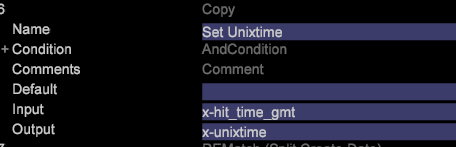

# Einrichten der Ereigniszeit{#setting-up-event-time}

{{eol}}

In diesem Abschnitt wird beschrieben, wie Sie Zeitstempel für einen Data Workbench-Datensatz erstellen.

## Die Ereigniszeit {#section-e10ef2b5b6244dc5b215836e3c77d663}

Die Ereigniszeit ist das Datum und die Uhrzeit, zu der die Anforderung (oder das Ereignis) eintritt.

Normalerweise gilt für Online-Daten Folgendes: *x_hit_time_gmt* wird als Zeitstempelfeld verwendet. Die Uhrzeit des Aufrufs kann als Zeitstempel für Offline-Daten (z. B. Callcenter-Daten) verwendet werden. Dies ist ein Pflichtfeld und alle Datenquellen sollten ein Feld enthalten, das als Zeitstempel verwendet werden kann. Diese Informationen sollten von Ihrer Organisation bereitgestellt werden.

In DWB erfassen die folgenden vordefinierten Variablen den Zeitstempel:

<table id="table_C24BD56CEB4E42F68D645EBB65585D16"> 
 <tbody> 
  <tr> 
   <td colname="col1"><i>x-timestamp</i> </td> 
   <td colname="col2"> 
 Datum und Uhrzeit (GMT), zu der die Anfrage beim Server empfangen wurde. Die Zeit wird als Anzahl von 100 Nanosekunden seit dem 1. Januar 1600 ausgedrückt. 
 
Beispiel: 127710989320000000 wäre die <i>x-timestamp</i> Wert für 11:28:52.0000000 am Dienstag, 13. September 2005. 
 </td> 
  </tr> 
  <tr> 
   <td colname="col1"><i>x-timestring</i> </td> 
   <td colname="col2"> <i>x-timestamp</i> im Format JJJJ-MM-TT HH:MM:SS.mmm. </td> 
  </tr> 
  <tr> 
   <td colname="col1"><i>x-unixtime</i> </td> 
   <td colname="col2"> <i>x-unixtime</i> ist die Epochszeit, die die Anzahl der Sekunden seit dem 1. Januar 1970 bei 00 darstellt.:00:01. </td> 
  </tr> 
 </tbody> 
</table>

Basierend auf dem Format des Datumsfelds wird x-timestamp oder x-unixtime oder x-timestring verwendet. Wenn die eingehenden Daten beispielsweise das Format JJJJ-MM-TT aufweisen, ist eine x-timestring-Zeichenfolge zu verwenden.

Der Zeitstempel wird in einem der Formate definiert und DWB generiert intern die beiden anderen Formate. Es handelt sich dabei auch um vordefinierte DWB-Felder. Derselbe Name sollte für kein anderes Feld verwendet werden.

## In DWB definierte Zeitzonen {#section-3cdd12254342442b917376661e1d9c9f}

Wenn das Datumsfeld eine der unten genannten Zeitzonen enthält, berücksichtigt DWB die gesamte Zeile in dieser bestimmten Zeitzone. Beispielsweise hat eine Datei das Datum definiert als 2015-01-01 00:00:00 GB und eine andere Datei hat den Wert 2015-01-01 00:00:00 Kosten, wird das Datum der ersten Datei in der GMT-Zeitzone berücksichtigt, während das Datum der zweiten Datei in der CST-Zeitzone liegt.

| Code | Zeitzone |
|---|---|
| gmt | Greenwich Mean |
| est | Eastern Standard |
| bearbeiten | Eastern Daylight |
| cst | Central Standard |
| cdt | Zentraler Tageslicht |
| mst | Mountain Standard |
| mdt | Mountain Daylight |
| pst | Pacific Standard |
| pdt | Pacific Daylight |

>[!NOTE]
>
>DWB verarbeitet nur die oben genannten Zeitzonen.

## Festlegen benutzerdefinierter Zeitzonen {#section-7c351921f22b439b81c73f40d5b47536}

DWB verarbeitet den Offset in der Zeitzone nicht. Um den Offset in Zeitzone zu berücksichtigen, sollten die Daten in dieser Zeitzone formatiert sein.

Beispiel: um das Datumsformat in der CST-Zeitzone zu berücksichtigen, sollten die Daten in JJJ-MM-TT HH vorliegen.:MM:Format SS UTC +/-HHMM vom Client.

10.18.2015 05:00:00 UTC -0200

## Festlegen von Ereigniszeit/Zeitstempel {#section-81507080f0b44ae6b83d3650ba019812}

Basierend auf dem Datumsfeldformat, *x-timestamp, x-unixtime* oder *x-timestring* verwendet. Im unten stehenden Beispiel seit der *x-hit_time_gmt* im Unix-Epochenformat vorliegt, *x-unixtime* verwendet.

Im DWB [!DNL foundation.cfg] -Datei (oder einer anderen Konfigurationsdatei im Ordner zur Datensatzprotokollverarbeitung) verwenden Sie die Kopierumwandlung, um die Ereigniszeit wie folgt festzulegen:

Basierend auf dem Datumsfeldformat wird x-timestamp, x-unixtime oder x-timestring-Variable verwendet. Im folgenden Beispiel wird x-unixtime verwendet, da x-hit_time_gmt im Unix-Epochenformat vorliegt.

Verwenden Sie in der insight-Datei foundation.cfg (oder einer anderen Konfiguration unter dem Protokollverarbeitungsordner von Datasetà) die Kopieumwandlung, um die Ereigniszeit wie unten gezeigt festzulegen: 

Wenn das Datum in ist JJJ-MM-TT HH:MM:Format SS.mmm, x-timestring wird verwendet. Beispiel: Wenn das Datumsfeld in dem nicht in DWB definierten Format liegt, beispielsweise JJJ/MM/TT, formatieren Sie es zunächst in einem vom DWB akzeptierten Zeitstempelformat und weisen Sie es dann der entsprechenden Variablen zu. Im folgenden Screenshot wird das Datum zunächst in das Format JJJ-MM-TT konvertiert und dann *x-timestring *Variable zugewiesen. 
