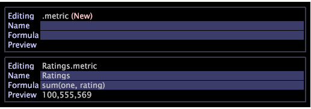
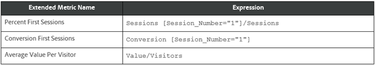

# Metriken einrichten{#metrics-setup}

In diesem Abschnitt wird das Erstellen von Metriken in Data Workbench erläutert.

## Metriken {#section-f0412e851fcb4ac9886dca4003d42cec}

Metriken sind quantitative Informationen zur Kundenaktivität, wie Ansichten, Bestellungen, Anzahl der getätigten Anrufe und Umsatz. Metriken bilden die Grundlage für Berichte und helfen Ihnen, Datenbeziehungen anzuzeigen und zu verstehen.

Metrikdimension ermöglicht Ihnen, Metrikzählungen nach einer bestimmten Ebene zu gruppieren. Außerdem können Sie Metrikzählungen nach einer bestimmten Ebene gruppieren.

## Erstellen neuer Metriken {#section-60a413899d1b4707965e06fb5ef7fc4e}

Gehen Sie wie folgt vor, um eine neue Metrik zu erstellen:

1. Klicken Sie auf **Tool** > **Metrik-Editor**.

1. Geben Sie im Metrik-Editor den neuen Metriknamen und die neue Formel ein. 

1. Speichern Sie sie im Ordner &quot;Metriken&quot;. 

## Erstellen und Bearbeiten abgeleiteter Metriken {#section-ebdcd3ec652f485e90e001d694eab6d0}

Verwenden Sie einen Metrik-Editor, um eine neue Metrik nach Name, Formel und Format zu definieren, die für die spätere Verwendung im [!DNL User\profile_name\Metrics] Ordner gespeichert wird.

1. Öffnen Sie einen neuen Metrik-Editor mit der Menüoption **Admin > Profil** oder indem Sie mit der rechten Maustaste auf die Spalte Benutzer für den Ordner klicken, in dem Sie die Metrik erstellen möchten, und auf **Erstellen > Neue Metrik** klicken. Es wird ein Metrik-Editor angezeigt.

1. Geben Sie im Parameter *Name* einen Namen für die neue Metrik ein.

   >[!NOTE]
   >
   >Beachten Sie, dass Leerzeichen ( ) zulässig sind, Unterstriche (_) nicht. Darüber hinaus können die folgenden Symbole nicht verwendet werden: + - * /

   

1. Geben Sie im Parameter *Formel* einen Ausdruck für die neue Metrik ein.

   >[!NOTE]
   Filter müssen in Klammern definiert werden [ ] im Ausdruck. Weitere Syntaxregeln für Metrikausdrücke finden Sie unter [Syntax für Metrikausdrücke.](https://docs.adobe.com/content/help/en/data-workbench/using/client/qry-lang-syntx/c-syntx-mtrc-exp.html)

   Diese Tabelle enthält Musterausdrücke für erweiterte Metriken. 

   >[!NOTE]
   Wenn ein passender Ausdruck eingegeben wird, zeigt die Vorschauzeile den Wert der neuen Metrik an. Wenn der Ausdruck einen Fehler enthält, wird in der Zeile &quot;Vorschau&quot;eine Fehlermeldung angezeigt.

1. Klicken Sie mit der rechten Maustaste und wählen Sie **Speichern**. Wenn Sie die Metrik speichern, wird auf Ihrem Computer eine Datei erstellt, die die neue Metrik darstellt, im Ordner &quot;DWB- *Installationsordner&quot;\User\profile name\Metrics* .

## Bearbeiten vorhandener abgeleiteter Metriken {#section-4b5b7baf885b45cc8b358d1bd774e925}

1. Klicken Sie im Profil-Manager oder Metriken-Manager in der Spalte Profilname mit der rechten Maustaste auf das Häkchen für die zu bearbeitende Metrikdatei und klicken Sie auf Lokal **machen**.
1. Klicken Sie mit der rechten Maustaste auf das Häkchen für die Metrikdatei in der Spalte &quot;Benutzer&quot;und klicken Sie in der Workbench auf &quot; **Öffnen** &quot;.

   >[!NOTE]
   Sie können auch einen Metrik-Editor öffnen, indem Sie mit der rechten Maustaste auf einen Metrik-bezogenen Bereich innerhalb einer Visualisierung klicken, um das Metrikmenü anzuzeigen.

1. Bearbeiten und speichern Sie die Metrikdefinition im **Metrikeditor** nach Bedarf mithilfe der Schritte 2-4 unter *Erstellen neuer abgeleiteter Metriken*.

   Wenn Sie möchten, dass alle Benutzer des Profils die von Ihnen bearbeitete Metrik verwenden, müssen Sie sie mithilfe des Profil-Managers im Arbeitsprofil veröffentlichen.

Weitere Informationen finden Sie in der Dokumentation:

[Syntax für Metrikausdrücke](https://docs.adobe.com/content/help/en/data-workbench/using/client/qry-lang-syntx/c-syntx-mtrc-exp.html)

[Erstellen und Bearbeiten abgeleiteter Metriken](https://docs.adobe.com/content/help/en/data-workbench/using/client/admin-ui/profile-mgr/c-drvd-mtrcs.html)
