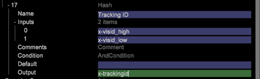
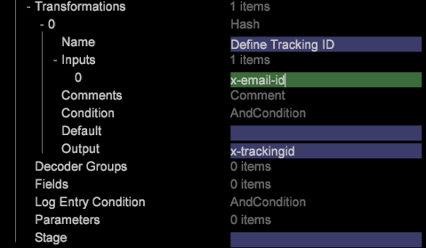

# Datenverarbeitung – Erstellen eines Primärschlüssels{#data-processing-building-primary-key}

{{eol}}

In diesem Abschnitt wird beschrieben, wie Sie Primäre Schlüssel (Tracking-ID) für Data Workbench-Datensätze für Schemadesign und -implementierung erstellen.

## Tracking-ID verstehen {#section-24683031044a4af49988655ccb9a45fd}

Nach dem Lesen und Dekodieren der Daten in DWB (mithilfe von Decodern) besteht der erste Schritt darin, die Tracking-ID und den Zeitstempel zu definieren. Die Tracking-ID ist eine Kennung, die einen Kundendatensatz eindeutig identifiziert. Dabei kann es sich um ein beliebiges Feld im Feed handeln, z. B. E-Mail-ID, Sozialversicherungsnummer, Cookie-ID usw. Das Feld, das als Tracking-ID verwendet werden soll, wird vom Client während der Erkennungssitzung festgelegt. Tracking-ID und Zeitstempel sind Pflichtfelder und müssen für jeden Datensatz definiert werden.

Normalerweise wird für Online-Daten die Cookie-ID (Kombination aus *x-visid_high* und* x-visid_low*) als Standardmechanismus für die eindeutige Kundenidentifizierung verwendet wird. Dies kann jedoch gemäß den Anforderungen des Kunden geändert werden. Das Datum und die Uhrzeit, zu der die Anforderung (oder das Ereignis) auftritt, ist das *x-timestamp*. Alle Datensätze in DWB werden gruppiert nach *trackingid* und nach Zeitstempel sortiert. Das erforderliche Feld [!DNL Definitions.cfg] -Datei ist eine Datensatzaufnahme-Datei zur Protokollverarbeitung, die die erforderlichen Felder definiert: *x-trackingid* und *x-timestamp*.

Hinweis: *x-trackingid *in DWB ist ein integriertes Feld und dieser Name sollte für kein anderes Feld verwendet werden.

**Beispiel 1**: Erstellen *x-trackingid* Verwenden der Cookie-ID (wenn nur Online-Daten verwendet werden)

Um die *x-trackingid *in DWB mithilfe der Cookie-ID zu erstellen, verwenden Sie die Hash-Funktion , um die *x-trackingid* im [!DNL foundation.cfg] -Datei (dies ist eine Best Practice, die Tracking-ID in [!DNL foundation.cfg] Sie kann jedoch in jeder anderen Konfigurationsdatei unter [!DNL Dataset > log processing] Ordner) wie gezeigt:

**Beispiel 2**: Erstellen *x-trackingid* Verwenden der E-Mail-ID (wenn sowohl Online- als auch Offline-Daten verfügbar sind)

Es wird angenommen, dass sowohl Offline- als auch Online-Daten verfügbar sind (in diesem Beispiel) und die E-Mail-ID in beiden Datenquellen verfügbar ist. Da die E-Mail-ID einen Kunden eindeutig identifiziert, wird sie zur Erstellung der *x-trackingid*.

Verwenden Sie die Hash-Funktion, um die *trackingId* wie gezeigt:

