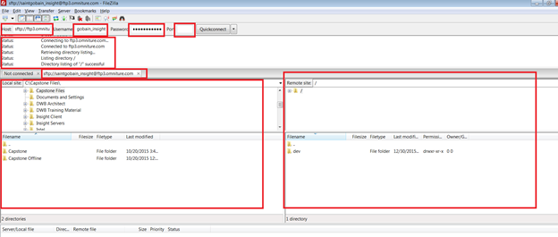

# Validierung interner und externer FTP-Server{#validation-of-internal-and-external-ftp-servers}

{{eol}}

Dies ist eine kurze Anleitung, in der Sie die erforderlichen Mindestschritte zur Validierung der internen und externen FTP-Einrichtung finden.

Ein interner FTP-Server wird verwendet, wenn ein in Adobe tätiger Berater/Architekt eine Verbindung zur FTP-Site zum Hochladen oder Herunterladen von Dateien herstellen muss, während ein externer FTP-Server hauptsächlich für Sie als Anwender zum Hochladen der erforderlichen Datendateien vorgesehen ist.

Weitere Informationen zum Einrichten von FTP-Servern finden Sie unter [File Transfer Protocol](https://experienceleague.adobe.com/docs/analytics/export/ftp-and-sftp/ftp-overview.html?lang=de).

## Validierungsschritte - Externes FTP {#section-24428111b5c542ce81a765cd63424b97}

1. Öffnen Sie eine Eingabeaufforderung. (Windows+R und Typ cmd)
1. Typ ftp `<ftp server>`
1. Geben Sie den Benutzernamen und das Kennwort ein. 

1. Ändern Sie das lokale Verzeichnis, aus dem Dateien verschoben werden können. Verwenden Sie diesen Befehl:

[!DNL ftp> lcd C:\Users\andixit\Desktop]

lokaler Ordner jetzt [!DNL C:\Users\andixit\Desktop].

1. Kopieren Sie die Datei vom lokalen zum Remote-Speicherort. 

1. Abmelden vom Remote-Server. (Befehl unten verwenden)

[!DNL ftp> bye]

[!DNL 221 Goodbye]

>[!NOTE]
>
>Eine andere Möglichkeit, FTP zu validieren, ist die Verwendung von FileZilla. Geben Sie Host Name, Benutzername, Kennwort und Anschluss an. Die rechte Seite des Bedienfelds ist eine Remote-Site und die linke Seite ist eine lokale Site. Um FTP zu validieren, ziehen Sie Dateien von der lokalen zur Remote-Site und v.v.

## Validierungsschritte - Internes FTP {#section-b1f7a789ad6848cf9027f7953d81066e}

Die oben genannten Schritte können ausgeführt werden, um das interne FTP-Programm von einem beliebigen Adobe-Server aus zu validieren.
