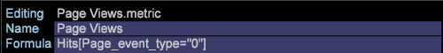
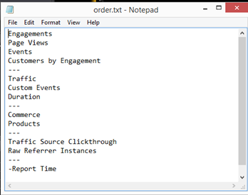

# Konfigurationsänderungen für neues Schema{#configuration-changes-for-new-schema}

In diesem Dokument wird beschrieben, wie Sie alle standardmäßigen Data Workbench-Konfigurationen ändern, nachdem das neue Schema eingerichtet wurde.

## Das Datenaset-Schema {#section-2ffac5170c894781bc943565af7ad479}

Die Grundlage des Datensatzschemas besteht aus einem wichtigen Satz von Beziehungen, die das Rückgrat des Data Workbench-Webanalyseschemas bilden. Im folgenden Beispiel bietet das typische Webanalyseschema eine Vorstellung von den Beziehungen zwischen einem Besucher, einem Besuch und einem Seitenaufruf. 

* Jeder einzelne Besucher kann einen oder mehrere Besuche haben.
* Jeder Besuch wird von nur einem Besucher generiert.
* Jeder Besuch kann eine oder mehrere Seitenansichten umfassen.
* Jede bestimmte Seitenansicht gehört nur zu einem Besuch. `<discoiqbr>`

Im Laufe der Jahre haben sich die Anforderungen der Web- und Datenanalyse verändert. Websites wurden als Orte zum Betrachten von Inhalten gegründet. Jetzt können Sie sich Inhalt ansehen. interaktiv über Chats, Videos oder Übermittlungen korrespondieren; Kaufprodukte; und vieles mehr. Darüber hinaus wollen Unternehmen ihre Webdaten nun mit anderen Datenkanälen in ihrem Unternehmen integrieren, um einen besseren Überblick über ihr gesamtes Geschäft zu erhalten. Ein Unternehmen möchte beispielsweise seine Web-, Call-Center-, E-Mail-, Social- und Store- sowie Kundendaten zusammenfassen. Mit dieser Integration von Offline- und Online-Kanälen haben sich die Dataset-Schemata im Laufe der Jahre weiterentwickelt, in denen keine zwei Datensatzschemata identisch sind.

`<discoiqbr>`Wenn Sie die Online- und Offlinedaten integrieren, erscheint der Begriff &quot;Besucher&quot;nicht immer angemessen. Daher wird manchmal der Begriff &quot;Kunde&quot;anstelle des Besuchers verwendet.  

Die Ebene &quot;Interaktion&quot;wird verwendet, um eine einzelne Ansicht der Zeit zu ermöglichen, wenn Daten aus mehreren Datenquellen vorliegen. Angenommen, Sie haben nur eine Datenquelle: E-Commerce-Daten, die von der Besucheraktivität auf Ihrer Website erfasst werden. In diesem Fall zeigt die Besuchsebene Besuche Ihrer Site von diesen Besuchern an. Beachten Sie, dass Zeitdimensionen - &quot;Tag&quot;, &quot;Woche&quot;, &quot;Monat&quot;usw. - werden in der Regel auf Besuchsebene erfasst.

Auf ähnliche Weise findet die &quot;Ereignisebene&quot;alle Ereignisse (Seitenansicht, Aufruf zum Call-Center usw.) während einer Interaktion statt. Es kombiniert alle Online- und Offline-Ereignisse für einen Kunden während einer Interaktion.

## Neue zählbare Struktur in DWB {#section-b77638ec04e4441cb51c56fd3d4abeb6}

Die neue Schemastruktur ersetzt Besucher nach Kunden, Besuch nach Interaktion und Treffer nach Ereignis. 

## Konfigurationsänderungen gemäß dem neuen Datensatzschema {#section-27135515be5c471ba2ee879d1ef4771f}

Um das Datensatzschema von Besucher zu Kunde zu ändern, müssen Sie die folgenden Konfigurationsdateien ändern:

1. Alle Konfigurationsdateien im Ordner &quot;DataSet&quot;, in denen zählbare und erweiterte Dimensionen definiert sind. 

1. Konfigurationsdateien im Dimensionsordner, in denen &quot;visitor&quot;, &quot;visit&quot;oder &quot;event&quot;als Ebene verwendet werden.

   Beispiel: Datei Campaign.cfg. Im Adobe SC-Profil wird Kampagne auf Besuchsebene definiert. 

   Im folgenden Beispiel wird eine Vorstellung der Änderung des übergeordneten Schemas von Besuch zu Interaktion gezeigt: 

1. Da einige der Metriken aus zählbaren Tabellen abgeleitet oder erstellt werden, müssen Konfigurationsdateien im Ordner &quot;Metriken&quot;geändert oder erstellt werden.

   Beispiel: eine neue Metrik [!DNL Customers.metric with formula = sum(one,customer)] oder als Seitenansichten.metrik erstellen, um sie auf Trefferebene zu *definieren* . Ändern Sie die Metrik und ändern Sie dann die Ebene in Ereignis anstelle von Treffer.

   Adobe SC-Metrik für Seitenansichten auf Trefferebene: 

   `<discoiqbr>` Die Metrik &quot;Seitenansichten&quot; `<discoiqbr>`lautet wie im neuen Schema: 

1. Ändern Sie die *Datei &quot;order.txt* &quot;im Ordner &quot;metrics&quot;, sodass sie die neuen oder geänderten Metriken zum Kunden, zur Interaktion und zum Ereignis widerspiegelt.

   Adobe *SC order.txt* -Datei. 

   *Order.txt* -Datei mit neuen Schemaänderungen: 

1. Alle Konfigurationsdateien (.vw) im Ordner &quot;Visualisierung&quot;sollten in neue Ebenen geändert werden: Kunde, Interaktion und Ereignis. Beispiel: 2D-Prozesszuordnung, 3D-Prozesszuordnung usw.

   Adobe SC-Standard-URI.vw für 2D-Prozesszuordnung wird auf Trefferebene und Besuchengruppe wie folgt definiert: 

   In &quot;URI.vw&quot;vorzunehmende Änderungen für neues Schema: 

