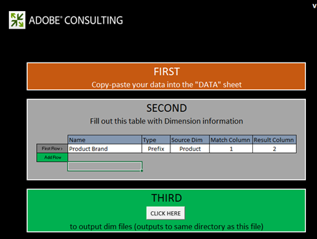
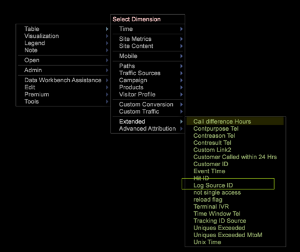

# Einrichten abgeleiteter Dimensionen{#derived-dimensions-setup}

{{eol}}

Die verschiedenen Typen von abgeleiteten (Client-seitigen) Dimensionen und wie diese in Data Workbench eingerichtet werden.

## Typen abgeleiteter Dimensionen {#section-33e6dcc9ab9745de9b830cecb2427ca3}

**Metrik-Dimensionen**

Mit der Dimension von Metriken können Sie Metrikzählungen nach einer bestimmten Ebene gruppieren. Sie können damit auch Metrikzählungen nach einer bestimmten Ebene gruppieren. Nach der Erstellung einer Metrik-Dimension können Sie Daten basierend auf dem Metrikwert segmentieren.

Beispiel 1: Sie sind ein Reiseunternehmen und möchten die unterschiedlichen Verhaltensweisen auf der Website zwischen Ihren Vielfliegern und Kunden verstehen, die weniger als fünfmal gebucht haben. Wie würden Sie das tun?

Sie haben lediglich die Anzahl der Buchungen als Metrik, wie segmentieren Sie Kunden anhand einer Metrik - hier, Buchung -, um ihr Verhalten auf der Website zu verstehen?

Beispiel 2: Sie sind eine Finanzbank und möchten Ihre Kunden nach der Anzahl der CDs gruppieren, in die sie investiert haben. Sie möchten Ihre Kunden in drei Stufen unterteilen. Tier 1 - Kunden mit mehr als 10 CDs, Tier 2 -Kunden mit mehr als 5 und &lt;10 CDs und Tier 3 -Kunden mit mehr als 0 und weniger als 5 CDs

Die Informationen, die Sie haben, sind Metriken, die Ihnen die Anzahl der CD-Investitionen geben - wie erstellen Sie für Ihre Analyse müde Kundensegmente?

*Erstellen einer Metrik-Dimension - über Workstation*

Markieren Sie eine der OOB-Metrikdimensionen als lokal und benennen Sie diese Dimension mit einem benutzerdefinierten Namen um. / Erstellen Sie eine lokale Kopie des Umbenennen von Dim.example und benennen Sie sie in den richtigen Dimensionsnamen mit der Erweiterung .dim um.

Öffnen Sie die neu erstellte Dimension in der Workstation, um Änderungen vorzunehmen. Ändern Sie die folgenden Parameter der Metrikdimension basierend auf den Anforderungen: 

Metrik - Zu gruppierende Metrik

Ebene - Ebene, auf der Metriken gruppiert werden

Bucket Start - Startelement der Metrik-Dimension. Geben Sie denselben Wert in den Versatz ein.

Behältergröße - Gruppierungsgröße der Metrik. Skalierungswert eingeben

Behälteranzahl - Maximale Anzahl der Elemente, die in der Dimension angezeigt werden sollen

Speichern Sie die neu erstellte Dimension auf dem Server, wenn Sie sie für andere freigeben möchten.

**Präfix-Dimensionen**

Der Hauptzweck der Präfixdimension besteht darin, Elemente der ursprünglichen Dimension zu gruppieren und den gruppierten Elementen benutzerfreundliche Namen zu geben.

Sie besitzen beispielsweise eine Einzelhandelssite, Ihre Site enthält verschiedene Sitebereiche wie Damenbekleidung, Herrenbekleidung, Spielzeug und Spiele, Heimkino usw. und jedem dieser Sitebereiche sind mehrere Seiten zugeordnet. Sie möchten eine Pfadanalyse durchführen und Einblicke in den Traffic erhalten, der von einem Sitebereich zum anderen geleitet wird usw. Wenn Sie die URI-Dimension verwenden, müssen Sie jede Seite jedes Website-Abschnitts im Pfadbrowser oder in der Prozesskarte abrufen und die Analyse fortsetzen.

Dieselbe Analyse kann einfach durchgeführt werden, wenn eine Präfixdimension vorhanden ist, in der Seiten eines Sitebereichs als einzelnes Element gruppiert sind.

Erstellen der Präfix-Dimension:

Öffnen Sie eine 2D-Prozesskarte im Menü Visualisierung .

Ändern Sie die folgenden Parameter der Präfixdimension entsprechend den Anforderungen.

Dimension der Zuordnung ändern - Die Dimension, die Sie für die 2D-Prozesszuordnung (z. B.: SMS-Typologie)

Dimension auf Map Level ändern - Ebene der oben genannten Dimension

Dimension des Map-Clip ändern - Die zählbare Ebene, auf der Sie die Daten anzeigen möchten.

Metrik ändern - Die Metrik, die Sie anzeigen möchten.

Sobald die 2D-Prozesszuordnung festgelegt ist, öffnen Sie die Dimension, die Sie im Parameter Dimension der Change Map erwähnt haben.

Wählen Sie die Elemente aus, die Sie gruppieren möchten. Verwenden Sie STRG+ALT und ziehen Sie die Elemente auf die Prozesszuordnung.

Klicken Sie mit der rechten Maustaste auf den angezeigten Punkt und benennen Sie den Gruppennamen um. Wenn Sie 3 Elemente für die Gruppierung ausgewählt haben, lautet der Standardname 3 Ausgewählt.

Klicken Sie mit der rechten Maustaste auf den Versandentwurf der Visualisierung und speichern Sie die Dimension im angezeigten Menü.

**Dimensionen umbenennen**

Dimensionen zum Umbenennen werden aus einer bereits vorhandenen Dimension erstellt. Der Hauptzweck der Umbenennungsdimension besteht darin, den Elementen der Dimension benutzerfreundliche Namen zu geben. Die vordefinierte Dimension Umbenennen ist die Dimension Seite , die aus der URI-Dimension erstellt wird. Die URI-Dimension kann für eine Person verwirrend sein, die die technischen Namen der Seiten nicht kennt. Aus diesem Grund können Sie mit der Dimension &quot;Seite&quot;Elemente der URI-Dimension umbenennen.

ERSTELLEN BENUTZERDEFINIERTER UMBENENNUNGS-DIMENSIONEN:

Elemente der umbenannten Dimension verfügen über eine 1:1-Zuordnung mit den Elementen der ursprünglichen Basisdimension. Sie können dies überprüfen, indem Sie die DIM-Datei der Dimension &quot;Umbenennen&quot;im Arbeitsstation/Hinweis-Pad öffnen. Sie werden feststellen, dass jedes Element der ursprünglichen Dimension nur einen Wert (String umbenennen) in der Datei enthält.

Wenn Sie weniger Elemente für den Umbenennungszweck haben; Sie können in der Workstation eine .dim -Datei erstellen und jedes einzelne Element anhand der unten erläuterten Schritte umbenennen.

Schritte zum Erstellen einer .dim-Datei für eine Dimension zum Umbenennen - Verwendung der Workstation

Verwenden Sie diese Option, wenn die Anzahl der Elemente, die umbenannt werden sollen, geringer ist.

1. Öffnen Sie einen leeren Arbeitsbereich und öffnen Sie den Dimensionen-Manager. Klicken Sie mit der rechten Maustaste auf > Admin > Profil > Profil-Manager.
1. Erweitern Sie den Ordner Dimensionen in der Spalte Datei .
1. Erweitern Sie den Seitenordner in der Spalte Datei und klicken Sie mit der rechten Maustaste auf die Datei Page.dim in der Spalte &quot;Zweiter zu Letzter&quot;(diese Spalte stellt normalerweise den Profilnamen dar) und klicken Sie auf die Option &quot;Lokal machen&quot;.
1. Klicken Sie mit der rechten Maustaste auf die Datei &quot;Page.dim&quot;in der Spalte &quot;User&quot;, klicken Sie auf die Option Kopieren und fügen Sie die kopierte .dim-Datei in den gewünschten Ordner unter dem Verzeichnis Dimensionen ein.
1. Klicken Sie in der Fehlermeldung auf OK .
1. Jetzt werden Sie feststellen, dass sich im Ordner &quot;Dimensionen&quot;zwei Page.dim-Dateien befinden. Die eine ist die Originaldatei im Verzeichnis Dimensionen\Seite und die andere ist die, die Sie gerade in Schritt 4 eingefügt haben.
1. Klicken Sie mit der rechten Maustaste auf die kürzlich eingefügte Datei &quot;Page.dim&quot;unter der Spalte &quot;Benutzer&quot;und klicken Sie auf das blaue/graue Eingabefeld, in dem &quot;Page.dim&quot;steht. Das Eingabefeld wird grün, wobei der Cursor blinkt und angibt, dass er geändert werden kann. Geben Sie den Namen der Dimension Umbenennen ein, die Sie erstellen möchten.
1. Sie werden feststellen, dass die Datei Page.dim in der Spalte Datei in den neuen Dateinamen geändert wurde, den Sie in Schritt 7 angegeben haben. Klicken Sie mit der rechten Maustaste auf die Datei new.dim in der Spalte Benutzer (letzte Spalte) und wählen Sie Öffnen > In Workstation.
1. Sobald die .dim -Datei auf der Workstation geöffnet wird; Klicken Sie auf das Pluszeichen (+) neben der Entität und erweitern Sie sie. Betrachten Sie den vorhandenen Wert für das Feld &quot;Übergeordnetes Element&quot;, spiegelt er die Dimension &quot;URI&quot;wider. Es wird &quot;wdata/model/dim/URI&quot;angezeigt Klicken Sie auf das blaue/graue Eingabefeld, um den URI in den Namen der Dimension zu ändern, deren Elemente Sie umbenennen möchten.
1. Stellen Sie sicher, dass die Dimension, die Sie umbenennen möchten, im Datensatz vorhanden ist. Bei den Namen von Dimensionen wird zwischen Groß- und Kleinschreibung unterschieden. Daher wird die Groß-/Kleinschreibung der ursprünglichen Dimension beibehalten.
1. Beachten Sie die &quot;Geändert&quot;-Anzeige neben dem Dimensionsnamen. Dies bedeutet, dass die ursprüngliche Dimension geändert wurde. die in Schritt 9 vorgenommenen Änderungen beizubehalten; Klicken Sie mit der rechten Maustaste auf new.dim (modifiziert) und klicken Sie auf die Option &quot;Speichern unter&quot;.
1. Sobald die Dimension in Schritt 10 gespeichert wurde, steht Ihnen die neu erstellte Umbenennungsdimension für die Kampagnen jetzt zum Zwecke der Umbenennung zur Verfügung. Dies ist nur lokal verfügbar.
1. Damit andere die von Ihnen erstellte Dimension sehen können, muss sie im Profil gespeichert werden. Klicken Sie mit der rechten Maustaste auf die .dim -Datei der neuen Dimension in der Spalte &quot;Benutzer&quot;(letzte Spalte) und klicken Sie auf &quot;Speichern unter > Profilname&quot;, in dem Sie die Dimension speichern möchten.
1. Nach dem Speichern der Datei im Profil können alle Workstation-Benutzer, die Zugriff auf dieses Profil haben, die Dimension zum Umbenennen für die Kampagnen sehen.

Präfix und Umbenennen des Dim Creator-Tools

Adobe verfügt über ein Excel-Tool zum Generieren von Dimensionen zum Präfix und Umbenennen.

Im Folgenden finden Sie die Schritte zum Generieren der Präfix-/Umbenennungsdimensionen mithilfe des Tools:

1. Excel-Tool speichern *Adobe_DWB_Dimension_Generator.xlsm* in einem Ordner. Wenden Sie sich an die Kundenunterstützung von Adobe, um das Tool herunterzuladen.
1. Öffnen Sie das Tool und aktivieren Sie Makros: 

1. Füllen Sie das Datenblatt mit den zu verwendenden Werten aus.

   Beispielsweise erstellen wir die Dimension &quot;Produktmarkenpräfix&quot;basierend auf der Dimension des Produkts. Im Datenblatt werden die folgenden Informationen erfasst: 

   Jedes Produkt wird einer Marke im Datenblatt zugewiesen.

1. Füllen Sie auf der Registerkarte Konfiguration die Informationen zur zu erstellenden Dimension aus. Für die obigen Beispieldaten werden folgende Informationen angegeben: 

   Name: Name für die Dimension &quot;Präfix/Umbenennen&quot;

   Typ: Präfix/Umbenennen

   Source Dim: Ursprüngliche Dimension

   Spalte abgleichen: Zu vergleichende Spalte

   Ergebnisspalte: Für neue Dimension zu verwendender Wert.

1. Klicken Sie auf die Schaltfläche mit dem Titel *Klicken Sie hier*. 

1. Die Datei &quot;dim&quot;wird in demselben Ordner generiert, in dem das Tool gespeichert wurde. 

   Speichern Sie mithilfe des Profilmanagers die Datei &quot;dim&quot;im Ordner &quot;Dimension&quot;.

**Umschalt-Dimensionen**

Mit den Umschalt-Dimensionen können Sie das n. Element einer beliebigen Dimension in einer beliebigen zählbaren Dimension betrachten.

Außerdem erhalten Sie die Möglichkeit, auf das n. Element einer beliebigen Dimension innerhalb einer bestimmten zählbaren Dimension zurückzublicken

Beispiel 1:

* n. Seite innerhalb einer Sitzung - Dimension der nächsten Seite
* Die n. Seite für einen Besucher - Nächste Seite für Besucher - für alle Sitzungen
* n. Aufruf für einen Benutzer

Warum ist es wichtig, das n. Element der zählbaren Dimension zu kennen?

* Sie möchten wissen, welche 5. Seite in einer Sitzung angezeigt wurde.
* Sie möchten Pfade zu Kampagnen durchführen, um zu verstehen, welche zweite Kampagne nach der Anzeige der Kampagne &quot;Kostenloses Kontrollkonto&quot;angezeigt wurde?
* Sie möchten wissen, auf welchen Link der Besucher geklickt hat, bevor er auf den Link &quot;Mit einem Agenten chatten&quot;klickt? 

Der nächste URI ist eine der OOB Shift-Dimensionen, die als Vorlage verwendet werden können. Im obigen Beispiel erhalten Sie das Element 2nd(Offset = 1) der Kampagne (Dim = Kampagne) im Interaktionsereignis (Clip = Interaktionsereignis).

Offset 1 bedeutet hier einen Blick nach rechts im Ereignis

Einige andere OOB Shift-Dimensionen

*Nächste Seite:*

Die nächste in einer Sitzung angezeigte Seite, nachdem in der Dimension &quot;Seite&quot;die Option &quot;Seite&quot;ausgewählt wurde

Hier ist Offset 1, Ebene ist Seitenansicht, Dim ist Seite und Clip ist Sitzung

*Vorherige Seite:*

Die vorherige Seite, die in einer Sitzung angezeigt wurde, bevor die aktuell ausgewählte Seite in der Dimension &quot;Seite&quot;ausgewählt war

Hier ist Versatz -1, Ebene ist Seitenansicht, Ziel ist Seite und Clip ist Sitzung

Welche Kampagne wird von einem Besucher vor der aktuell ausgewählten Kampagne angezeigt?

Hier ist Versatz -1, Ebene ist Kampagnenantwort, Ziel ist Kampagnenantwort-Attributwert und Clip ist Besucher

*Erstellen der Dimension der Umschalt-Bearbeitung - über Workstation*

* Markieren Sie eine der OOB-Schichtdimensionen als lokal
* Umbenennen dieser Dimension mit einem benutzerdefinierten Namen
* Öffnen Sie die neu erstellte Dimension in der Workstation, um Änderungen vorzunehmen.
* Ändern Sie die folgenden Parameter der Metrikdimension basierend auf den Anforderungen.

   * Level-Countable-Dimension
   * Offset-Du willst nach vorne blicken
   * Dim -Dimension, deren Elemente Sie analysieren möchten
   * Clip-zählbar in Sie möchten anzeigen.

* Speichern Sie die neu erstellte Dimension auf dem Server, wenn Sie sie für andere freigeben möchten.

**Letzte N Dimension**

Die letzten N Dimensionen werden nur bei der Time-Dimension und der As-Of-Time des Systems ausgeführt. Die OOB-Zeitdimensionen sind Tag, Woche, Stunde und Monat. Sie können für jede dieser Basiszeitdimensionen die Dimension Letzte N erstellen, z. B. Letzte 10 Tage, Letzte 72 Stunden, Letzte 8 Wochen, Letzte 6 Monate usw. Die letzte N Dimension berechnet die letzte N auf Grundlage der aktuellen &quot;Berichtszeitmetrik&quot;oder der Zeit des Systems. 

Zählung - Gesamtzahl der Elemente, die in der Dimension angezeigt werden sollen

Bereichsversatz - Versatzwert zur Angabe des Startpunkts (Tag/Woche) zur Berechnung der letzten N Tage/Woche.

**None.dim**

None.dim ist eine Alias-Dimension. Sie wird verwendet, um einen Alias aus erweiterten Dimensionen zu erstellen.

Beispiel:

In None.dim wird die Entität als &quot;wdata/model/dim/Parent/+name&quot;(kann geändert werden) definiert, was bedeutet, die Dimension gemäß dem Namen der Dimensionsdatei zu erstellen. Wenn wir also eine Kopie der Datei None.dim im Ordner Dimension erstellen (in diesem Beispiel die Datei None.dim kopieren und umbenennen unter Besucherprofilordner) und sie in &quot;Protokollquelle-ID.dim&quot;umbenennen, wird im Menü unter Besucherprofil eine neue abgeleitete Dimension mit Protokollquellen-ID angezeigt, wie unten dargestellt:

Vor Änderungen: 

Nach den Änderungen von None.dim: 

Die Entität kann in den Namen der erweiterten Dimension geändert werden, in diesem Fall eine andere Dimension mit einem anderen Namen, der auf dieselbe Dimension verweist, wie unten dargestellt:

In diesem Beispiel enthält &quot;Source Name.dim&quot;den folgenden Inhalt: 

Daher wird ein anderer Quellname der Dimension angezeigt, der auf die Protokollquellen-ID verweist. 

**Ausblenden abgeleiteter Dimensionen**

Um die abgeleitete Dimension auszublenden, legen Sie die *Anzeigen* auf &quot;false&quot;gesetzt. 
