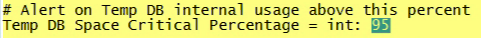

# Überwachungsprofil installieren{#installing-the-monitoring-profile}

Anweisungen zum Installieren des Datenbasisüberwachungsprofils der Workbench.

## Installationsschritte {#section-d4355dbea8a447f48ab168db6ccff612}

1. Konfigurieren Sie eine neue Sensor-Instanz so, als ob sie für die Datenerfassung mit Tags versehene Webseiten verwendet wird. Vergewissern Sie sich, dass sich die Datei &quot;zig.gif&quot;im Dokumentenstamm des Sensor-Webservers befindet. Sensor kann auf demselben Host wie die Monitorprofile ausgeführt werden. (Dies ist kein Problem, wenn Sie zu diesem Zweck eine Textdatei verwenden.)

   >[!NOTE]
   >
   >Diese Sensor-Instanz muss dem Empfang von Traffic von den Überwachungsagenten gewidmet sein. Außerdem kann der Sensor so konfiguriert werden, dass er an einem anderen Anschluss ausgeführt wird, wenn Sie einen Webserver für diese Sammlung neu verwenden.

1. In der [!DNL txlogd.conf] Datei befindet sich die Standardzeile:

   ```
   <b>ContentFilterExclude</b> image/,text/css,application/x-javascript,text/javascript
   ```

   Für die Data Workbench Monitoring Profile-Anwendung (oder jede &quot;getaggte&quot;Seitenimplementierung) muss der Bildtyp entfernt werden, um über eine GIF-Datei erfasst zu werden. Die aktualisierte Zeile lautet:

   ```
   <b>ContentFilterExclude </b>text/css,application/x-javascript,text/javascript
   ```

1. Kopieren Sie die Datei [!DNL insight_monitor.zip/insight_monitor_agent] an einen temporären Speicherort.
1. Aktualisieren Sie [!DNL insight_monitor_agent.cfg] die Datei für Ihre Umgebung. Befolgen Sie die Kommentare in der Konfigurationsdatei:

   **Die Überwachungskonfigurationsdatei:**

   

   Definieren Sie, wo Sie alle Informationen erfassen, und geben Sie die URL-Adresse ein. Dies muss ein spezieller Sensor sein und sollte außer dieser Anwendung keinen Traffic erhalten.

   

   Es gibt Pfade, sofern ein e vorhanden ist: Datenträger. Möglicherweise möchten Sie diesen Pfad für Ihre Umgebung ändern.

   

   Bei Ausführung eines Transform-Profils reagiert Data Workbench möglicherweise nicht. Mit diesem Wert können Sie eine Warnung senden, wenn der Prozess dreimal hintereinander nicht reagiert. Auf diese Weise lassen sich Falsch-Positiv-Warnungen verringern.

   

   Hier legen Sie die Umgebung und die Gruppendimensionen fest. Dies kann sich von Host zu Host unterscheiden.

   Hier sehen Sie genau, was der Monitoragent tut, indem Sie Fehlerprotokolle in diesem Pfad anzeigen.

   

   Dies ist die interne Verwendung der temporären DB. Es kann bei der Erzielung von Kapazitäten alarmiert werden. Dies unterscheidet sich von der physischen Speichernutzung.

1. Kopieren Sie den Ordner *insight_monitor_agent* auf jeden DPU- und FSU-Host, auf dem der Data Workbench-Server ausgeführt wird. Der in der Konfigurationsdatei angegebene Standardspeicherort ist [!DNL e:\insight_monitor_agent] jedoch möglich.

1. Fügen Sie eine geplante Windows-Aufgabe hinzu, um den Agent alle 10 Minuten aufzurufen (dieser Zeitraum wird in den Berechnungen der Verarbeitungsrate angenommen). Das Programm ist [!DNL e:insight_monitor/insight_monitor_agent.exe]. Das Argument ist config-file e:\insight_monitor\insight_monitor.cfg. Starten Sie in e:\insight_monitor. Der Benutzer, der die Aufgabe ausführt, muss über die Berechtigung zum Lesen/Schreiben [!DNL e:\insight_monitor] und Lesen des Win32 OLE-Objekts verfügen [!DNL root\CIMV2] (erforderlich, um den Startmodus des Data Workbench-Serverdienstes zu ermitteln und den Prozentsatz des Speichers auf lokalen Festplatten zu überprüfen)

1. Vergewissern Sie sich, dass die VSL-Datei mit der Akkumulation von Monitordatensätzen zu wachsen beginnt. Dies dauert einige Zeit, da das Traffic-Volumen in einer kleinen Installation extrem niedrig sein wird (alle 10 Minuten sendet der Agent nur einen Treffer für die hostspezifischen Daten plus einen Treffer pro Verarbeitungsprofil).
1. Dekomprimieren Sie insight_monitor.zip\profiles\Insight Historic to a temporary location.
1. Aktualisieren Sie den Hostnamen in [!DNL profile.cfg], [!DNL [!DNL dataset\cluster.cfg]] und die [!DNL [!DNL dataset\segment export.cfg]].

1. Aktualisieren Sie die Dateien in den Ordner &quot;data workbench profiles&quot;.
1. Aktualisieren Sie den Protokollserver und den Pfad [!DNL dataset\log processing.cfg] zum Speicherort, an dem sich die Sensor-VSLs akkumulieren.
1. [Optional] können Sie dasselbe auch mit den Profilen [!DNL Insight Profile Status] und [!DNL Insight Server Status]. Darüber hinaus sollten die Statusprofile nachts mit einem zweitägigen Fenster erneut verarbeitet werden. Hinzufügen einer geplanten Windows-Aufgabe: Das Programm ist [!DNL e:\insight_monitor\insight_reprocess.exe]. Das Argument ist [!DNL --profile-path="PATH TO PROFILES\insight profile status" --start-days-ago=2]. Lassen Sie [!DNL start in] leer! Fügen Sie eine weitere geplante Aufgabe für den *&quot;Insight-Serverstatus&quot;* hinzu. *insight_reprocess.exe* erfordert Lese-/Schreibzugriff auf *log processing.cfg* , um die Startzeit zu aktualisieren.

1. Darüber hinaus sollten die Statusprofile nachts mit einem zweitägigen Fenster erneut verarbeitet werden. Hinzufügen einer geplanten Windows-Aufgabe: Das Programm ist *e:\insight_monitor\insight_reprocess.exe*. Das Argument ist - [!DNL -profile-path="PATH TO PROFILES\insight profile status" --start-days-ago=2]. Lassen Sie *los* . Fügen Sie eine weitere geplante Aufgabe für [!DNL "insight server status"]hinzu. [!DNL insight_reprocess.exe] Lese-/Schreibzugriff erforderlich, um die Startzeit [!DNL log processing.cfg] zu aktualisieren. Vergewissern Sie sich, dass jedes Profil die VSLs des Monitors liest, während sie akkumuliert werden. Auch dies wird wegen des extrem niedrigen Volumens einige Zeit dauern - vermutlich Stunden.

## Installationshinweise {#section-17722441ab0046fcbcb46b957d56230a}

* **Konfigurieren des Überwachungsprofils in einer lizenzierten Testumgebung**. Das Paket für die Testumgebung ist in Ihrer Implementierung von Data Workbench enthalten, sodass Sie die Anwendung installieren und konfigurieren können. Bei einer Installation auf einem Produktions-FSU- oder DPU-Server müssen Sie den Server für die Ausführung auf einem separaten Port konfigurieren.
* **Bereitstellung eines neuen Sensors speziell für das Überwachungsprofil**. Sie müssen eine neue Instanz von Sensor auf dem Server installieren, auf dem das Überwachungsprofil ausgeführt wird. Dies ist zusätzlich zur Produktionsinstanz von Sensor. (Für die Installation von Sensor auf einem Produktions- oder Nicht-Produktionsserver speziell für das Überwachungsprofil fallen keine zusätzlichen Kosten an.)
* **Deaktivieren Sie den Monitoragenten während der Datenbasis-Wartung**. Um eine Verschmutzung der Betriebszeit- und Leistungsmetriken zu vermeiden, können Sie den Dienststartmodus für den Dienst InsightServer (Omniture Insight Server) auf manuell einstellen. Ein praktischer PowerShell-Befehl ist *set-service -name insightserver -startuptype Handbuch*. Stellen Sie sie nach der Wartung wieder auf automatisch ein: *set-service -name insightserver -startuptype automat*. Eine andere Möglichkeit besteht darin, die geplante Aufgabe des Monitoragenten vorübergehend zu deaktivieren.
* **Die Statusprofile benötigen ein nachfolgendes Fenster** , um alte Hosts und Profile sowie alte Zuordnungen von Hostprofilen abzulegen. Wenn die Anzahl der Ereignisdaten jedoch so gering ist, dass Data Workbench sie nicht puffert, müssen Sie die Größe des Fensters möglicherweise etwas erweitern, um es zu verarbeiten.
* **Der Agent erfasst den gesamten und ältesten Ausführungszeitpunkt aus dem detaillierten Status** der Data Workbench, der in der lokalen Hostzeit gemeldet wird, vorausgesetzt, die Zeitstempel für die Ereignisdatenprotokolle befinden sich in UTC (wie in VSL-Dateien). Wenn sich die Zeitstempel der Ereignisdaten in einer Nicht-UTC-Zeitzone befinden, wird der Zeitablauf im resultierenden Insight-Profilstatusprofil verrechnet. Wenn sich **alle** Zeitstempel der Ereignisdaten in derselben Zeitzone befinden, können Sie diesen Offset zu *Insight Profile Status\metrics\as of delay minutes.metric* hinzufügen.

* **Es wurden zwei neue Dimensionen eingeführt, um dem Kunden zu helfen, seine Server zu gruppieren, wenn sie sich in verschiedenen Status** befinden, wie z. B. Produktion, Staging, Testserver und Server in anderen Status. Wenn Sie z. B. nach &quot;uptime&quot;suchen, dann betrachten Sie Server nur im Produktionsmodus. Die Gruppendimension ist daher nur eine weitere Möglichkeit, Server beliebig zu gruppieren, um Ihre Anforderungen zu erfüllen. Beispielsweise können Sie in der Überwachungskonfigurationsdatei festlegen, welcher Host Ihre Abteilung wartet, z. B. Vorgänge, Entwicklung oder Marketing.

