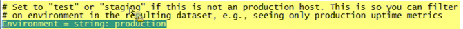

# Installieren des Überwachungsprofils{#installing-the-monitoring-profile}

Anweisungen zur Installation des Data Workbench-Überwachungsprofils.

## Installationsschritte {#section-d4355dbea8a447f48ab168db6ccff612}

1. Konfigurieren Sie eine neue Sensor-Instanz so, als ob sie für die Datenerfassung von getaggten Web-Seiten verwendet wird. Stellen Sie sicher, dass sich die Datei &quot;zig.gif&quot;im Dokumentenstamm des Sensor-Webservers befindet. Sensor kann auf demselben Host wie die Monitorprofile ausgeführt werden. (Dies ist kein Problem bei der Verwendung einer Textdatei zu diesem Zweck.)

   >[!NOTE]
   >
   >Diese Sensor-Instanz muss dafür ausgelegt sein, nur Traffic von den Überwachungsagenten zu empfangen. Außerdem kann der Sensor so konfiguriert werden, dass er an einem anderen Anschluss ausgeführt wird, wenn Sie einen Webserver für diese Sammlung wiederverwenden.

1. In der Datei [!DNL txlogd.conf] gibt es die Standardzeile:

   ```
   <b>ContentFilterExclude</b> image/,text/css,application/x-javascript,text/javascript
   ```

   Für die Data Workbench Monitoring Profile-Anwendung (oder eine beliebige &quot;getaggte&quot;Seitenimplementierung) muss der Bildtyp entfernt werden, um über eine GIF-Datei erfasst zu werden. Die aktualisierte Zeile lautet:

   ```
   <b>ContentFilterExclude </b>text/css,application/x-javascript,text/javascript
   ```

1. Kopieren Sie [!DNL insight_monitor.zip/insight_monitor_agent] an einen temporären Speicherort.
1. Aktualisieren Sie die [!DNL insight_monitor_agent.cfg]-Datei für Ihre Umgebung. Befolgen Sie die Kommentare in der Konfigurationsdatei:

   **Die Konfigurationsdatei Überwachung :**

   

   Definieren Sie, wo Sie alle Informationen sammeln, und geben Sie die URL-Adresse an. Dies muss ein spezieller Sensor sein und sollte außer dieser Anwendung keinen Traffic erhalten.

   

   Es gibt Pfade unter der Annahme, dass ein e vorhanden ist: Datenträger. Sie können diesen Pfad für Ihre Umgebung ändern.

   

   Manchmal reagiert Data Workbench beim Ausführen eines Transform-Profils nicht. Mit diesem Wert können Sie eine Warnung senden, wenn der Prozess dreimal hintereinander nicht reagiert. So lassen sich falsch-positive Warnhinweise verringern.

   

   Hier legen Sie die Umgebungs- und Gruppendimensionen fest. Dies kann sich von Host zu Host unterscheiden.

   Dies ist w Hier können Sie genau sehen, was der Monitoragent tut, indem Sie Fehlerprotokolle in diesem Pfad anzeigen.

   

   Dies dient der internen Verwendung des temporären DB. Sie kann beim Erreichen der Kapazität gewarnt werden. Dies unterscheidet sich von der physischen Festplattenauslastung.

1. Kopieren Sie den Ordner *insight_monitor_agent* in jeden DPU- und FSU-Host, der den Data Workbench-Server ausführt. Der in der Konfigurationsdatei angegebene Standardspeicherort lautet [!DNL e:\insight_monitor_agent]. Sie können diesen Speicherort jedoch ändern.

1. Fügen Sie eine geplante Windows-Aufgabe hinzu, um den Agenten alle 10 Minuten aufzurufen (dieser Zeitraum wird in den Berechnungen der Verarbeitungsrate angenommen). Das Programm ist [!DNL e:insight_monitor/insight_monitor_agent.exe]. Das Argument ist config-file e:\insight_monitor\insight_monitor.cfg. Starten Sie in e:\insight_monitor. Der Benutzer, der die Aufgabe ausführt, muss über die Berechtigung zum Lesen/Schreiben von [!DNL e:\insight_monitor] und Lesen des Win32 OLE-Objekts [!DNL root\CIMV2] verfügen (erforderlich zum Ermitteln des Startmodus des Data Workbench-Server-Dienstes und zum Überprüfen des Speicherprozentsatzes auf lokalen Festplatten).

1. Vergewissern Sie sich, dass die VSL mit der Akkumulation von Monitordatensätzen zunimmt. Dies wird einige Zeit in Anspruch nehmen, da das Traffic-Volumen in einer kleinen Installation extrem niedrig sein wird (alle 10 Minuten sendet der Agent nur einen Treffer für die hostspezifischen Daten sowie einen Treffer pro Verarbeitungsprofil).
1. Entpacken Sie insight_monitor.zip\profiles\Insight Historic to a temporary location.
1. Aktualisieren Sie den Hostnamen in [!DNL profile.cfg], [!DNL dataset\cluster.cfg] und [!DNL dataset\segment export.cfg].

1. Aktualisieren Sie die Dateien in das Profilverzeichnis der Data Workbench.
1. Aktualisieren Sie den Protokollserver und den Pfad in [!DNL dataset\log processing.cfg] an den Speicherort, an dem sich die Sensor-VSL ansammeln.
1. [] Optional können Sie dasselbe mit den Profilen  [!DNL Insight Profile Status] und  [!DNL Insight Server Status]tun. Außerdem sollten die Statusprofile nächtlich mit einem zweitägigen Nachverfolgungsfenster erneut verarbeitet werden. Hinzufügen einer geplanten Windows-Aufgabe: Das Programm ist [!DNL e:\insight_monitor\insight_reprocess.exe]. Das -Argument ist [!DNL --profile-path="PATH TO PROFILES\insight profile status" --start-days-ago=2]. Lassen Sie [!DNL start in] leer. Fügen Sie eine weitere geplante Aufgabe für *&quot;insight server status&quot;* hinzu. *insight_reprocess.* erfordert Lese-/Schreibzugriff auf die  *Protokollverarbeitung.* cfgg, um die Startzeit zu aktualisieren.

1. Außerdem sollten die Statusprofile nächtlich mit einem zweitägigen Nachverfolgungsfenster erneut verarbeitet werden. Hinzufügen einer geplanten Windows-Aufgabe: Das Programm ist *e:\insight_monitor\insight_reprocess.exe*. Das -Argument ist - [!DNL -profile-path="PATH TO PROFILES\insight profile status" --start-days-ago=2]. Lassen Sie *Beginn in* leer. Fügen Sie eine weitere geplante Aufgabe für [!DNL "insight server status"] hinzu. [!DNL insight_reprocess.exe] erfordert Lese-/Schreibzugriff auf ,  [!DNL log processing.cfg] um die Startzeit zu aktualisieren. Vergewissern Sie sich, dass jedes Profil die VSL liest, während sie sich ansammeln. Auch dies wird aufgrund des extrem niedrigen Volumens einige Zeit - wahrscheinlich Stunden - in Anspruch nehmen.

## Installationshinweise {#section-17722441ab0046fcbcb46b957d56230a}

* **Konfigurieren des Überwachungsprofils in einer lizenzierten Testumgebung**. Das Paket der Testumgebung ist in Ihrer Implementierung von Data Workbench enthalten, sodass Sie die Anwendung installieren und konfigurieren können. Bei einer Installation auf einem Produktions-FSU- oder DPU-Server müssen Sie den Server so konfigurieren, dass er auf einem separaten Port ausgeführt wird.
* **Bereitstellung eines neuen Sensors speziell für das Überwachungsprofil**. Sie müssen eine neue Instanz von Sensor auf dem Server installieren, auf dem das Überwachungsprofil ausgeführt wird. Dies erfolgt zusätzlich zur Produktionsinstanz von Sensor. (Für die Installation von Sensor auf einem Produktions- oder Nicht-Produktionsserver, speziell für das Überwachungsprofil, fallen keine zusätzlichen Gebühren an.)
* **Deaktivieren Sie den Monitoragenten während der Data Workbench-Wartung**. Um eine Verschmutzung der Betriebszeit- und Leistungsmetriken zu vermeiden, können Sie den Dienststartmodus für den InsightServer-Dienst (Omniture Insight-Server) auf &quot;Manuell&quot;festlegen. Ein praktischer PowerShell-Befehl ist *set-service -name insightserver -startuptype manual*. Setzen Sie es nach der Wartung wieder auf automatisch: *set-service -name insightserver -startuptype automate*. Eine andere Möglichkeit besteht darin, die geplante Aufgabe des Überwachungsagenten vorübergehend zu deaktivieren.
* **Die Statusprofile benötigen ein nachstehendes** Fenster, in dem alte Hosts und Profile sowie alte Hostprofil-Zuordnungen abgelegt werden können. Wenn die Anzahl der Ereignisdaten jedoch so gering ist, dass Data Workbench sie nicht puffert, müssen Sie die Fenstergröße möglicherweise etwas erweitern, um die Verarbeitung zu ermöglichen.
* **Der Agent erfasst den gesamten und ältesten Ausführungsstatus** aus Data Workbench im Detail, der in der lokalen Hostzeit gemeldet wird, vorausgesetzt die Zeitstempel für die Ereignisdatenprotokolle befinden sich in UTC (wie in VSL Dateien). Wenn sich die Zeitstempel der Ereignisdaten in einer nicht-UTC-Zeitzone befinden, wird der Ausführungszeitpunkt im resultierenden Insight-Profilstatus-Profil versetzt. Wenn sich **alle** Ihrer Zeitstempel für Ereignisdaten in derselben Zeitzone befinden, können Sie diesen Versatz zu *Insight Profile Status\metrics\as of delay minutes.metric* hinzufügen.

* **Es wurden zwei neue Dimensionen eingeführt, um die Kundengruppe bei Servern mit unterschiedlichen Status** zu unterstützen, z. B. bei Produktion, Staging, Testservern und Servern in anderen Status. Wenn Sie z. B. nach &quot;uptime&quot;suchen, dann betrachten Sie Server nur im Produktionsmodus. Die Dimension &quot;Gruppe&quot;ist daher nur eine weitere Möglichkeit, Server beliebig nach Bedarf zu gruppieren. Beispielsweise können Sie in der Konfigurationsdatei für die Überwachung festlegen, welchen Host Ihre Abteilung hat, z. B. Vorgänge, Entwicklung oder Marketing.
