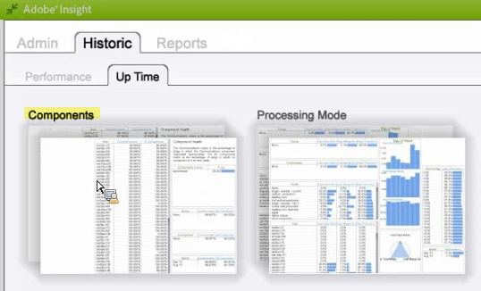

# Data Workbench-Arbeitsbereich zur Historie{#data-workbench-historic-workspace}

{{eol}}

Verwenden Sie das Data Workbench-Profil Historie , um zu sehen, wie sich Konfiguration, Hardware und andere Änderungen auf die Leistung, Stabilität und Serverkapazität im Laufe der Zeit auswirken.

Das Profil &quot;Historie&quot;enthält ein profilbasiertes [Profilleistung](../../../home/monitoring-installation/monitoring-profiles/monitoring-historical-using.md#section-184a86f9de054970bf68515bb9dea85d) und dem serverbasierten [Serverleistung](../../../home/monitoring-installation/monitoring-profiles/monitoring-historical-using.md#section-5dad5870384b40e094d50173fcd90a09) Datensatz unter dem **[!UICONTROL Performance]** Registerkarte. Dies sind die am häufigsten verwendeten Datensätze, die für eine frühere Sicht der Data Workbench-Serverleistung angezeigt wurden. Darüber hinaus können Sie die [Komponenten](../../../home/monitoring-installation/monitoring-profiles/monitoring-historical-using.md#section-5be7223abb384784bafe7b37c764ea66) und [Verarbeitungsmodus](../../../home/monitoring-installation/monitoring-profiles/monitoring-historical-using.md#section-5be7223abb384784bafe7b37c764ea66) durch Auswahl der **[!UICONTROL Up Time]** Registerkarte.

Darüber hinaus können Sie die [Komponenten](../../../home/monitoring-installation/monitoring-profiles/monitoring-historical-using.md#section-5be7223abb384784bafe7b37c764ea66) und [Verarbeitungsmodus](../../../home/monitoring-installation/monitoring-profiles/monitoring-historical-using.md#section-5be7223abb384784bafe7b37c764ea66) durch Auswahl der **[!UICONTROL Up Time]** Registerkarte.

Weitere Referenzinformationen zu den im Data Workbench-Profil verwendeten Dimensionen finden Sie unter [Dimensionen im Historischen Insight-Profil.](../../../home/monitoring-installation/monitoring-appendix/monitoring-historical.md#concept-a42837c9c9274f83ad5bc5a6720f02b0)

## Arbeitsbereich zur Profilleistung {#section-184a86f9de054970bf68515bb9dea85d}

Dieser Datensatz enthält die folgenden relevanten Metriken für die Data Workbench-Überwachung.

* Schnelle Eingabe MegaBytes pro Minute - Metriken mit hoher Dateneingabe während der anfänglichen Protokollverarbeitung.
* Schnelles Zusammenführen von MegaBytes pro Minute - Metriken, die die Transformation anzeigen.

>[!NOTE]
>
>Um eine echte Leistungsbewertung Ihres Profils durchzuführen, überprüfen Sie die Rate und nicht die verstrichene Kalenderzeit. Die Rate wird als geänderte Werte zwischen den Abfragen alle zehn Minuten gemessen.

## Arbeitsbereich &quot;Serverleistung&quot; {#section-5dad5870384b40e094d50173fcd90a09}

Dieser Datensatz überwacht Servermetriken, die über den Umfang der enthaltenen Profile hinausgehen, und enthält die folgenden relevanten Servermetriken für die Überwachung in Data Workbench.

* Geschätzte Sweep-Minutes - Geschätzte Abfrageauflösungszeit.
* Latenzzeit in Millisekunden der Umfrage - Gibt an, wie beschäftigt Software ist, indem gemessen wird, wie lange es dauert, bis ein vollständiger Wartungszyklus für jede Komponente durchlaufen wird.

## Komponentenarbeitsbereich {#section-5be7223abb384784bafe7b37c764ea66}

Dieser Datensatz befindet sich auf der Registerkarte &quot;Up Time&quot;.

Der Komponenten-Datensatz umfasst zwei Aspekte für die Komponentengesundheit:

* Kommunikationsmetrik - Hat der Data Workbench-Serverprozess reagiert?
* Metrik &quot;Alle Komponenten&quot;- Oben auf der Seite &quot;Detaillierter Status&quot;befindet sich eine Liste der Komponenten, die der Host innerhalb der Data Workbench-Serverprozesse bereitstellt. Wenn eine Komponente einen Fehlerstatus aufweist, wird sie in der Tabelle &quot;Komponenten&quot;in der Tabelle &quot;Fehler&quot;aufgeführt.

## Arbeitsbereich &quot;Verarbeitungsmodus&quot; {#section-3e1dedb9474e4b4ba513240943e76817}

Dieser Arbeitsbereich befindet sich auf der Registerkarte &quot;Zeit bis&quot;. In diesem Arbeitsbereich können Sie feststellen, wie viel Zeit in den Modi &quot;Schnelle Eingabe&quot;, &quot;Schnelle Zusammenführung&quot;und &quot;Echtzeit&quot;benötigt wird.

Dieser Datensatz bietet wichtige Eigenschaften für die Server-Auslastung, z. B. die Ermittlung der Datenlast für

* Wochentag (z. B. schnelle Eingangsrate am Dienstag und Mittwoch),
* Stunde des Tages (welcher Anteil des Tages befindet sich im Modus Schnelle Eingabe?)
