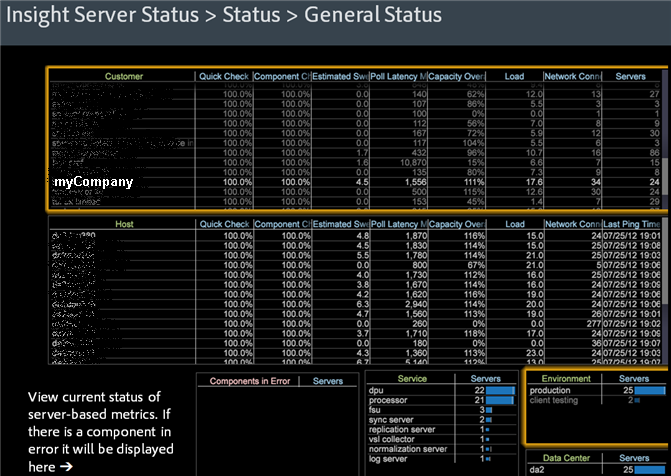

# Data Workbench-Arbeitsbereich zum Server-Status{#data-workbench-server-status-workspace}

{{eol}}

Das Server-Statusprofil von Data Workbench bietet aktuelle Informationen zum Server-Status von Data Workbench basierend auf dem Server und nicht auf Profilmetriken oder historischen Daten.

## Allgemeiner Status {#section-65d1fa393cfd450cbacef3cba823fcc1}

Öffnen Sie die Ansicht &quot;Allgemeiner Status-Datensatz&quot;im Data Workbench-Profil &quot;Server Status&quot;.

Weitere Referenzinformationen zu den im Data Workbench-Profil zum Server-Status verwendeten Dimensionen finden Sie in der [Dimensionen im Insight Server-Statusprofil](../../../home/monitoring-installation/monitoring-appendix/monitoring-servers-profile.md#concept-8cbeb91e99bc42e2b52b22d551423f8a) Profil.

## Festplattenstatus {#section-36406f5f1262457e89ff13ad917f621f}

Zeigen Sie die aktuelle Festplattenauslastung einschließlich der internen Nutzung von temp.db an.

